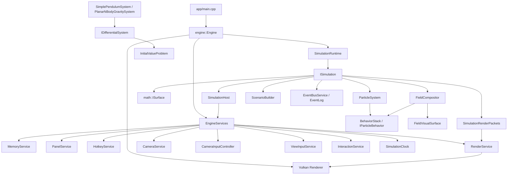
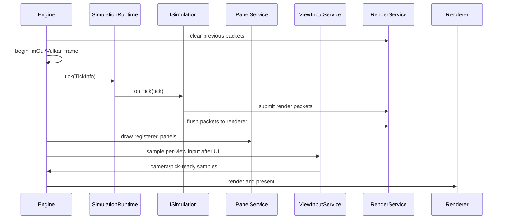

# Architectural Design

**Last updated:** 2026-05-16

This document describes the intended architecture of `nurbs_dde` after the
simulation refactor. It is both an implementation map and a design contract:
the code should make the mathematical claims in `front-matter.tex` practical,
testable, and difficult to violate by accident.

## Design Goal

`nurbs_dde` is a composable geometric simulation engine. The active application
is currently centered on stochastic pursuit on a dynamic surface, but the
architecture is broader: it should host surface walkers, ODE systems, DDE
systems, stochastic particle systems, and gravitational systems such as
pendula and planar solar-system models.

The core rule is:

```text
Engine owns lifecycle and services.
Simulation owns mathematical state.
Services own cross-cutting capabilities.
Renderer receives packets only.
Fields alter dynamics, metric, and visible geometry through one pipeline.
```

## C++ Engineering Standard

Implementation should follow modern C++ best practices as expressed in the C++
Core Guidelines and related industry guidance. The project targets modern C++
in the C++20/C++23 style: prefer clear ownership, RAII, value semantics where
appropriate, strong project scalar aliases, and narrow dependencies.
Use project standard types such as `byte`, `f32`, `f64`, `i32`, `u32`, and `u64`
where they express project-owned domain data. It is acceptable to use native
boundary types such as `int`, `std::size_t`, or external enum/integer types
where the STL, ImGui, GLFW, Vulkan, or another library API expects them.

Prefer the standard vocabulary types available in modern C++20/C++23 when they
make intent explicit: `std::optional` for meaningful absence, `std::expected`
for recoverable fallible operations, and `std::variant` for closed sets of
known runtime categories. These should be favored over sentinel values, loosely
structured status codes, output-parameter error channels, or `dynamic_cast`
where a type-safe result or sum type expresses the contract clearly.

Use the Rule of Zero for ordinary value/config/model types. Use the Rule of
Three or Rule of Five where a type manages ownership, lifetime, polymorphism, or
non-trivial copy/move behavior. Abstract interfaces should make slicing
impossible while still allowing derived types to use appropriate copy/move
semantics.

After major changes and before check-ins, run the normal build/tests and the
clang-tidy build. The tidy build is the guardrail for guideline issues such as
special member function policy:

```powershell
cmake -S . -B cmake-build-tidy -G Ninja -DCMAKE_BUILD_TYPE=Tidy
cmake --build cmake-build-tidy --target nurbs_dde
```

## Layer Map



## Current Active Simulation

The default runtime currently registers only:

- `SimulationWavePredatorPrey`

Archived simulations live under `src/old`. They are useful references, but they
are not active runtime components until ported to the current `ISimulation`
and service model.

This distinction matters: documents or UI that imply the old ODE/DDE scenes are
active should be treated as stale until those scenes are ported.

## Engine And Service Boundaries

`Engine` coordinates the frame, but simulations do not receive the concrete
engine. They receive `SimulationHost`, a narrower facade over:

- `PanelService`
- `HotkeyService`
- `InteractionService`
- `RenderService`
- `CameraService`
- `SimulationClock`
- `MemoryService`

`EngineServices` is the composition root. It owns service instances and wires
service dependencies, such as `CameraService` depending on `RenderService`.

## Frame Flow



Input is sampled after panels draw so view ownership can use current-frame UI
hover/capture state. This avoids the previous regression where a Vulkan
background view inferred mouse ownership from stale global ImGui state.

## View Input

`ViewInputService` owns per-render-view pointer state:

- view rectangle
- hover eligibility
- drag capture
- normalized pointer coordinates
- screen NDC
- button state
- wheel state
- double-click intent

`Engine` converts platform/UI data into `ViewInputUpdate`. The service returns
`ViewInputSample`, which is then translated by `CameraInputController` into
camera commands:

- orbit
- pan
- zoom
- select hover
- pick surface
- pick 2D view point

This keeps input ownership separate from both rendering and simulation logic.

## Render Views

`RenderService` owns renderer-neutral view descriptors. A simulation registers
one or more `RenderViewDescriptor`s and submits geometry packets to those view
IDs. The renderer consumes packets; it should not know simulation semantics.

Typical view kinds:

- `Main`: perspective 3D surface view
- `Alternate`: orthographic or analytical view such as contour, phase-space, or
  vector-field view

## Simulation Contract

All runtime simulations implement `ISimulation`:

```cpp
class ISimulation {
public:
    virtual std::string_view name() const = 0;
    virtual void on_register(SimulationHost& host) = 0;
    virtual void on_start() = 0;
    virtual void on_tick(const TickInfo& tick) = 0;
    virtual void on_stop() = 0;
    virtual SceneSnapshot snapshot() const;
    virtual SimulationMetadata metadata() const;
};
```

A simulation owns:

- surfaces
- particles and histories
- equation systems
- scenario-specific fields
- alert rules
- render view handles
- panel/hotkey handles
- event bus and event log state

A simulation should not own:

- Vulkan objects
- raw ImGui window lifecycle outside registered panel callbacks
- global input state
- renderer packet storage
- memory arenas

## Surface And Metric Model

`math::ISurface` is the geometric base interface. It provides:

- parameter domain
- periodicity
- evaluation `p(u, v, t)`
- derivatives `du`, `dv`
- normal, Gaussian curvature, and mean curvature helpers
- metadata

`math::IDeformableSurface` extends `ISurface` for surfaces with their own
internal time evolution.

The active predator/prey simulation currently wraps its base surface in a
`FieldVisualSurface`, which asks `FieldCompositor` for visible displacement.
This keeps metric ripple geometry in the same field pipeline that drives the
metric factor.

## Field Pipeline

Environmental effects implement `simulation::IField`.

An `IField` can contribute:

- drift in parameter space
- diffusion scaling
- conformal metric factor
- rendered surface displacement
- active/decayed lifecycle state
- event/log identity through `name()`

`FieldCompositor` combines active fields:

- drift is summed
- diffusion factors are multiplied componentwise
- metric factors are multiplied
- surface displacement is summed
- decayed fields are swept by simulation time

This is the central abstraction tying the front-matter language to code:
fields are independent components, and composition is explicit in the
compositor rather than scattered across simulation-specific state.

Current field examples:

- `DampingField`
- `MetricRipple`

Important current limitation: `MetricRipple` contributes conformal metric and
visible displacement, but it does not yet scale Brownian diffusion by
`g^{-1}`. That should be added through `diffusion_contribution()`.

## Particles And Behaviors

`ParticleSystem` owns active particles, pair constraints, goals, and update
flow. Each particle is an `AnimatedCurve` driven by an equation or behavior
stack.

`BehaviorStack` composes `IParticleBehavior` instances and now consumes the
active `FieldCompositor` through `SimulationContext`.

Current behavior families include:

- constant drift
- Brownian noise
- seek/avoid pursuit
- centroid seek
- gradient drift
- orbit
- flocking

Current particle update order:

1. Build a `SimulationContext`
2. Bind context to each particle behavior stack
3. Advance particle with deterministic or stochastic integrator
4. Record trail sample
5. Push history sample
6. Apply pair constraints

## Scenario Builder

`simulation::ScenarioBuilder` is the declarative construction path for agent
scenarios. It can:

- name a scenario
- attach a surface
- add one or many agents from `AgentSpec`
- attach fields
- attach alert rules
- dispatch scenario/agent/field events

`AgentSpec` currently describes identity, spawn mode, Brownian noise, pursuit,
history, trails, telemetry preference, and a `StealthSpec`.

Important current limitation: `StealthSpec` exists but is not yet applied by
`ScenarioBuilder`. Stealth alerts can detect curvature budget violations, but
there is no behavior or projection constraint that enforces the budget.

## ODE, DDE, And Gravity Systems

The scalar/vector equation layer lives in `src/sim`.

ODE path:

- `IDifferentialSystem`
- `InitialValueProblem`
- `EulerOdeSolver`
- `Rk4OdeSolver`

DDE path:

- `IDelayDifferentialSystem`
- `DelayInitialValueProblem`
- `EulerDdeSolver`
- `DelayHistoryView`

Gravitational systems are represented as ODE systems:

- `SimplePendulumSystem`
- `PlanarNBodyGravitySystem`

These systems are currently reusable mathematical components with tests. They
are not yet exposed as an active runtime scene. The intended next step is a
`SimulationGravitational2D` or equivalent scene that registers:

- a phase/trajectory view
- controls for solver, timestep, masses, softening, and presets
- presets for simple pendulum, two-body orbit, and small solar system
- telemetry and energy diagnostics

## Events, Alerts, Logging, And Telemetry

`EventBusService` is the engine-owned route for discrete runtime happenings.
Active simulations publish through `SimulationHost::events()` into service-owned
channels rather than owning private event buses. `EventLog` remains the compact
record sink for panel display; `LoggerService` owns human-readable narrative
text, larger strings, filtering, and future file sinks.

Current event contract:

- typed events carry IDs, project scalar values, enums, ticks, and compact
  coordinates
- typed events do not carry owned strings, paths, blobs, JSON, or formatted
  messages
- service-published records receive per-channel sequence numbers
- worker threads submit compact `EventRecord` values through the worker mailbox
- `SimMetadataService` can register `EventDescriptor` records so tools can
  discover event types without relying on string payloads
- raw internal `events::EventBus` access is a legacy/internal escape hatch and
  should not be the normal publication path

Current alert concepts:

- proximity
- escape
- stealth lost/restored
- capture pending
- custom alerts

Alerts currently write compact `EventRecord` values directly to the service-owned
simulation event ring. If alert behavior later needs typed subscribers, route
that through `EventBusService` rather than adding simulation-owned buses.

Telemetry records particle snapshots and supports richer simulation-provided
records through `on_telemetry_tick`.

Important current limitation: telemetry fields for `geodesic_k` and
`metric_factor` exist, but base particle snapshot recording still writes
defaults unless a simulation overrides them. The predator/prey simulation should
eventually populate local metric factor and geodesic curvature for every
particle telemetry row.

## Memory Model

`MemoryService` separates allocation by lifetime:

- frame
- view
- simulation
- cache
- history
- persistent

Simulation-owned long-lived state should use simulation/history lifetimes.
Per-frame render packet payloads should use frame lifetime. Renderer-visible
geometry is rebuilt into packet streams and submitted through `RenderService`.

## Design Contracts

### Renderer Neutrality

Simulation code may build geometry but should submit it only through
`RenderService`. Vulkan-specific code belongs below the renderer boundary.

### Mathematical Ownership

Mathematical state lives in simulations and `src/sim`/`src/math` components.
Panels display and adjust state; they should not be the only place where a
mathematical action is encoded.

### Field Coherence

If an environmental effect changes the metric, drift, diffusion, or visible
surface, it should do so through `IField` and `FieldCompositor`. Avoid parallel
simulation-specific state that duplicates field behavior.

### View Input Ownership

Per-view input belongs to `ViewInputService`. Engine code may sample GLFW and
ImGui, but eligibility, capture, normalized coordinates, and double-click
intent should be stored per view.

### Testable Systems

ODE, DDE, field, particle, and input behavior should be testable without
opening a Vulkan window.

## Front-Matter Compliance Matrix

| Claim in `front-matter.tex` | Current status | Gap / next fix |
| --- | --- | --- |
| Composable simulation engine | Partly implemented | Only one active scene; old ODE/DDE scenes need porting |
| Agents declared through common interface | Partly implemented | `ParticleSystem` and behavior stack exist; general policy interface is missing |
| Metric ripples triggered by pokes | Implemented | Add diffusion scaling and telemetry for local metric factor |
| Potential wells | Partly implemented through old surfaces/gradient behaviors | Add `PotentialField` as first-class `IField` |
| Damping fields | Implemented | Confirm semantics: current damping is positional drift, not velocity drag |
| Geodesic flows | Partly represented by shortest periodic deltas | Need metric-aware geodesic/distance service |
| Bundle-style field composition | Partly implemented | Extend field types for tensor-valued metric beyond conformal scalar |
| Stealth curvature constraint | Detection partly implemented | Add enforcement behavior/projection for `StealthSpec` |
| Pack strategy/topological trapping | Conceptual only | Add coverage functional and torus homology-aware diagnostics |
| Neural policy evolution | Not implemented | Add `Policy`, `PolicyPopulation`, `FitnessEvaluator`, and rollout harness |
| SDE with delay | Partly implemented | Particle delay history exists; metric-correct diffusion still missing |
| Laplace-Beltrami connection | Conceptual/comment-level only | Add metric tensor and diffusion tests against `g^{-1}` |
| Vulkan real-time rendering | Implemented | Continue keeping renderer simulation-neutral |
| Gravitational simulations | Component support added | Add active runtime scene and UI presets |

## Recommended Roadmap

### Near Term

1. Port `SimulationDifferential2D` and `SimulationDelayDifferential2D` out of
   `src/old` into the current service architecture.
2. Add a `SimulationGravitational2D` scene using `SimplePendulumSystem` and
   `PlanarNBodyGravitySystem`.
3. Implement `MetricRipple::diffusion_contribution()` so Brownian noise responds
   to the conformal metric.
4. Rename or revise `DampingField` if its intended meaning is velocity drag;
   the current implementation is positional drift toward the origin.

### Medium Term

1. Introduce a `ManifoldMetric` or `MetricService` abstraction:
   - local tensor
   - inverse tensor
   - shortest delta
   - distance approximation
   - gradient of distance
2. Move pursuit and Brownian diffusion to the metric abstraction.
3. Implement `PotentialField` and `VectorField` as first-class fields.
4. Wire `StealthSpec` into behavior construction.
5. Add telemetry rows for metric factor, local curvature, and stealth state.

### Long Term

1. Add policy-driven agents.
2. Add evolutionary training and replayable rollout seeds.
3. Add coverage/topological trapping diagnostics.
4. Add adaptive timestep controls based on metric Lipschitz estimates and
   curvature budgets.

## Add-New-System Checklist

When adding a new mathematical system:

1. Put reusable math in `src/math`, `src/numeric`, or `src/sim`.
2. Put runtime orchestration in an `ISimulation` implementation.
3. Register render views through `RenderService`.
4. Route panels through `PanelService`.
5. Route input through `ViewInputService`, `CameraInputController`, and
   `InteractionService`.
6. Route fields through `IField` and `FieldCompositor`.
7. Store dynamic data through `MemoryService`.
8. Add focused tests that do not require a window.
9. Only then register the simulation in `SceneFactories.cpp`.
