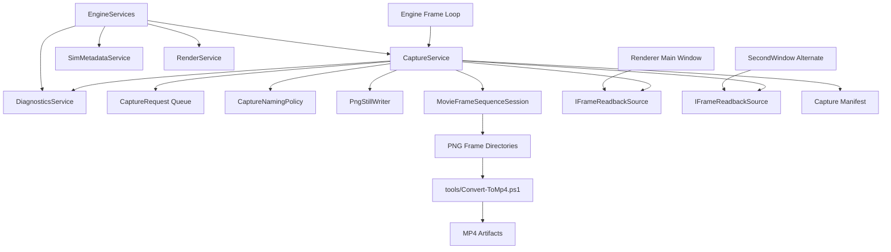

# CaptureService Design

**Status:** design contract  
**Scope:** PNG still capture, movie frame-sequence capture, capture file naming, and per-window frame readback  
**Owner:** `EngineServices`  
**Intent:** make visual run artifacts reproducible, named, and associated with simulation metadata

## Purpose

`CaptureService` owns requests to save what the user is seeing.

It answers:

- Capture the main window as a PNG.
- Capture the alternate window as a PNG.
- Capture both windows as a matched PNG set.
- Start and stop movie frame-sequence capture for both windows.
- Name output files using the active run metadata.
- Record enough sidecar metadata to connect the image or movie back to the
  simulation, run, window, tick, sim time, and scenario descriptor.

This service is not telemetry and not logging.

```text
CaptureService = visual artifacts written to files.
Telemetry      = sampled numeric/state measurements over time.
Logging        = narrative event/history text.
Diagnostics    = correctness/trust issues.
```

## C++ Engineering Standard

Implementation should follow modern C++ best practices as expressed in the C++
Core Guidelines and related industry guidance. The project targets modern C++
in the C++20/C++23 style: prefer clear ownership, RAII, value semantics where
appropriate, strong project scalar aliases, and narrow dependencies.
Use project standard types such as `byte`, `f32`, `f64`, `i32`, `u32`, and `u64`
where they express project-owned domain data. It is acceptable to use native
boundary types such as `int`, `std::size_t`, or external enum/integer types
where the STL, ImGui, GLFW, Vulkan, FFmpeg, or another library API expects
them.

Prefer the standard vocabulary types available in modern C++20/C++23 when they
make intent explicit: `std::optional` for meaningful absence, `std::expected`
for recoverable fallible operations, and `std::variant` for closed sets of
known runtime categories. These should be favored over sentinel values, loosely
structured status codes, output-parameter error channels, or `dynamic_cast`
where a type-safe result or sum type expresses the contract clearly.

Use the Rule of Zero for ordinary value/config/model types. Use the Rule of
Three or Rule of Five where a type manages ownership, lifetime, polymorphism, or
non-trivial copy/move behavior. Abstract interfaces should make slicing
impossible while still allowing derived types to use appropriate copy/move
semantics.

After major changes and before check-ins, run the normal build/tests and the
clang-tidy build. The tidy build is the guardrail for guideline issues such as
special member function policy:

```powershell
cmake -S . -B cmake-build-tidy -G Ninja -DCMAKE_BUILD_TYPE=Tidy
cmake --build cmake-build-tidy --target nurbs_dde
```

## Is It Possible?

Yes.

PNG capture is already partially implemented for the primary renderer:
`Engine::request_capture()` calls `Renderer::request_png_capture()`, and the
renderer copies the presented swapchain image into CPU memory before writing a
PNG. The new service should generalize that path so both the main Vulkan window
and `SecondWindow` expose the same capture interface.

Movie capture is possible, but MP4 conversion should not run inside the app:

- The app writes a named sequence of image frames for each captured window.
- The app writes a manifest that records frame rate, dimensions, run metadata,
  and output paths.
- Offline conversion to MP4 is handled by `tools/Convert-ToMp4.ps1`.
- Manifest file writes are handed to the logger/I/O task lane when
  `ThreadManagementService` is available, so capture metadata does not need to
  block the UI/render path.

This keeps FFmpeg and video encoding out of the runtime. Missing FFmpeg should
never affect normal app startup, still PNG capture, or simulation shutdown.

## Ownership

`CaptureService` is owned by the engine through `EngineServices`.

```cpp
class EngineServices {
public:
    CaptureService& capture() noexcept;
};
```

The engine drives service lifecycle because it owns:

- active simulation runtime
- renderers/windows
- run metadata
- frame boundaries
- shutdown ordering

Renderers do not own capture policy or file naming. Renderers only provide
readback capability for their current swapchain image.

## Architectural Position



## Non-Goals

`CaptureService` should not:

- own Vulkan swapchains
- draw UI panels directly
- replace telemetry
- store high-frequency simulation records
- decide simulation state or pause policy by itself
- require FFmpeg for normal app startup
- invoke FFmpeg or perform MP4 conversion in-process
- block every frame when no capture is active

## Core Concepts

### Capture Target

A target identifies which window/view to capture.

```cpp
enum class CaptureTarget : u8 {
    MainWindow,
    AlternateWindow,
    BothWindows
};
```

### Capture Mode

```cpp
enum class CaptureMode : u8 {
    StillPng,
    MovieFrameSequence
};
```

### Capture Metadata

Capture metadata describes the artifact and links it to the active run.

```cpp
struct CaptureRunMetadata {
    std::string simulation_name;
    std::string scenario_name;
    std::string run_id;
    u64 simulation_index = u64(0);
    u64 tick = u64(0);
    f32 sim_time = f32(0);
    f32 wall_seconds = f32(0);
    std::string started_at_utc;
};
```

The service should source these values from the active runtime, metadata
service, and telemetry run metadata where available. It should not duplicate the
telemetry writer, but it may share the same run ID and filename stem policy.

### Capture Request

```cpp
struct CaptureRequest {
    CaptureMode mode = CaptureMode::StillPng;
    CaptureTarget target = CaptureTarget::MainWindow;
    bool pause_before_capture = false;
    bool include_manifest = true;
    std::string label;
};
```

### Capture Artifact

```cpp
struct CaptureArtifact {
    CaptureMode mode = CaptureMode::StillPng;
    CaptureTarget target = CaptureTarget::MainWindow;
    std::filesystem::path path;
    std::filesystem::path manifest_path;
    u32 width = u32(0);
    u32 height = u32(0);
    u64 tick = u64(0);
    f32 sim_time = f32(0);
};
```

### Movie Frame Sequence Session

```cpp
struct MovieFrameSequenceOptions {
    CaptureTarget target = CaptureTarget::BothWindows;
    u32 fps = u32(60);
    u32 max_width = u32(0);
    u32 max_height = u32(0);
    bool write_frame_index = false;
};

struct MovieFrameSequenceStatus {
    bool active = false;
    CaptureTarget target = CaptureTarget::BothWindows;
    u64 frames_written = u64(0);
    f32 elapsed_seconds = f32(0);
    std::filesystem::path main_frame_dir;
    std::filesystem::path alternate_frame_dir;
    std::filesystem::path manifest_path;
};
```

## Public API

```cpp
class CaptureService {
public:
    CaptureService() = default;
    ~CaptureService();

    CaptureService(const CaptureService&) = delete;
    CaptureService& operator=(const CaptureService&) = delete;
    CaptureService(CaptureService&&) = delete;
    CaptureService& operator=(CaptureService&&) = delete;

    void set_output_dir(std::filesystem::path directory);
    void set_naming_policy(CaptureNamingPolicy policy);

    void request_still(CaptureRequest request);

    [[nodiscard]] bool start_movie_frames(MovieFrameSequenceOptions options,
                                          CaptureRunMetadata metadata);
    void stop_movie();

    void begin_frame(CaptureFrameContext context);
    void capture_after_render(IFrameReadbackSource& main,
                              IFrameReadbackSource* alternate);
    void end_frame();

    [[nodiscard]] bool movie_frames_active() const noexcept;
    [[nodiscard]] MovieFrameSequenceStatus movie_frame_status() const;
    [[nodiscard]] std::span<const CaptureArtifact> completed_artifacts() const noexcept;
    void clear_completed_artifacts() noexcept;
};
```

## Frame Readback Source

Renderers should expose a narrow readback interface. This keeps capture policy
out of Vulkan classes while letting each window implement the Vulkan details it
already owns.

```cpp
enum class FramePixelFormat : u8 {
    Rgba8,
    Bgra8
};

struct FrameImage {
    u32 width = u32(0);
    u32 height = u32(0);
    FramePixelFormat format = FramePixelFormat::Rgba8;
    std::span<const std::byte> pixels;
};

class IFrameReadbackSource {
public:
    virtual ~IFrameReadbackSource() = default;

    [[nodiscard]] virtual RenderViewKind view_kind() const noexcept = 0;
    [[nodiscard]] virtual bool can_readback() const noexcept = 0;

    virtual bool request_readback(FrameReadbackRequest request) = 0;

protected:
    IFrameReadbackSource() = default;
    IFrameReadbackSource(const IFrameReadbackSource&) = default;
    IFrameReadbackSource& operator=(const IFrameReadbackSource&) = default;
    IFrameReadbackSource(IFrameReadbackSource&&) = default;
    IFrameReadbackSource& operator=(IFrameReadbackSource&&) = default;
};
```

The immediate implementation may be simpler than this API: `Renderer` and
`SecondWindow` can each expose `request_png_capture(path)`. The service should
still be designed around `IFrameReadbackSource` so frame-sequence capture does
not become two duplicated renderer code paths.

## Naming Policy

Capture files should use the same normalized stem style as telemetry.

Recommended still capture layout:

```text
captures/
  wave_predator_prey_0_20260516_230839/
    wave_predator_prey_0_20260516_230839_main_tick0003143_t0052.383.png
    wave_predator_prey_0_20260516_230839_alternate_tick0003143_t0052.383.png
    wave_predator_prey_0_20260516_230839_capture_manifest.md
```

Recommended movie frame layout:

```text
captures/
  wave_predator_prey_0_20260516_230839/
    main_frames/
      frame_000001.png
      frame_000002.png
    alternate_frames/
      frame_000001.png
      frame_000002.png
    wave_predator_prey_0_20260516_230839_movie_frames_manifest.md
```

Offline conversion can then produce:

```text
wave_predator_prey_0_20260516_230839_main.mp4
wave_predator_prey_0_20260516_230839_alternate.mp4
```

Do not overwrite existing artifacts. If a name already exists, append a small
monotonic suffix:

```text
..._main_002.png
..._main_frames_002/
```

## Manifest

Every capture operation should be able to write a small Markdown manifest.

```markdown
# Capture: Wave Predator-Prey

- Run ID: wave_predator_prey_0_20260516_230839
- Scenario: Wave Predator-Prey
- Simulation index: 0
- Tick: 3143
- Sim time: 52.383
- Target: BothWindows
- Mode: StillPng

## Artifacts

- Main: wave_predator_prey_0_20260516_230839_main_tick0003143_t0052.383.png
- Alternate: wave_predator_prey_0_20260516_230839_alternate_tick0003143_t0052.383.png
```

Markdown remains the human source of truth for documentation. A later JSON
sidecar may be generated for tooling, but it is not required for the first
implementation.

## Offline MP4 Conversion

The app should not convert frames to MP4. It should only write image frames and
metadata. Conversion is a tooling concern.

The conversion script is:

```powershell
tools/Convert-ToMp4.ps1 -InputPath captures/run_id/main_frames -FrameRate 60
tools/Convert-ToMp4.ps1 -InputPath captures/run_id/alternate_frames -OutputPath captures/run_id/alternate.mp4
```

The script accepts:

- a directory containing `frame_000001.png` style image sequences
- a single image file, converted to a short still video
- an existing video file, transcoded to MP4

FFmpeg command shape for a frame directory:

```text
ffmpeg -framerate 60 -i frame_%06d.png -c:v libx264 -pix_fmt yuv420p output.mp4
```

The script owns FFmpeg discovery/errors. The app should not check for FFmpeg
unless a future UI wants to display a convenience note.

### PowerShell Script Contract

```powershell
.\tools\Convert-ToMp4.ps1 `
    -InputPath .\captures\run_id\main_frames `
    -OutputPath .\captures\run_id\main.mp4 `
    -FrameRate 60 `
    -Overwrite
```

### No In-App Encoder Backend

Do not add an `IMovieEncoder`, FFmpeg process manager, raw-video pipe, or MP4
writer to the runtime app unless this design is deliberately revised. The app's
movie feature means "record a clean, named frame sequence."

## Engine Integration

Engine hotkeys can become capture commands:

- `F12`: capture PNG of both windows
- `Ctrl+Shift+P`: pause and capture PNG of both windows
- future `Ctrl+F12`: start/stop frame-sequence capture of both windows

The frame loop should process capture after render commands have been recorded
and before present where possible. For current Vulkan code, capture is already
implemented in `Renderer::end_frame()` by copying the swapchain image before
transitioning to present. `SecondWindow` should gain the same readback path.

```cpp
void Engine::request_capture(bool pause_first) {
    if (pause_first)
        active_runtime().pause();

    CaptureRequest request{
        .mode = CaptureMode::StillPng,
        .target = CaptureTarget::BothWindows,
        .pause_before_capture = pause_first
    };
    m_services.capture().request_still(std::move(request));
}
```

## Diagnostics Integration

`CaptureService` should report diagnostics for:

- output directory cannot be created
- PNG write failed
- readback source unavailable
- alternate window closed during requested capture
- movie frame size changed during active recording
- frame sequence stopped during shutdown with unflushed frames

Diagnostic component IDs should be stable:

```cpp
namespace ndde::runtime_ids {
inline constexpr ComponentId service_capture{"service.capture"};
}
```

## Metadata Integration

`SimMetadataService` should describe capture capabilities as service metadata:

- `CaptureStillPng`
- `CaptureMovieFrameSequence`
- `CaptureMainWindow`
- `CaptureAlternateWindow`
- `CaptureBothWindows`

This allows UI panels to enable/disable capture controls based on capabilities.
MP4 conversion remains an offline tooling action.

## Threading And Performance

Still PNG capture may block for a single frame in the first implementation.
That is acceptable.

Capture manifest writes are small but still file I/O. Current implementation
routes still and movie-frame manifests through `ThreadManagementService` logger
tasks, with immediate direct writes only when the service is used without a
thread manager in tests or standalone tools.

Movie frame capture should not block the render loop on disk stalls. The
recommended future pipeline is:

```text
render thread readback -> bounded frame queue -> PNG worker thread -> frame files
```

If the queue fills, the service should either:

- drop movie frames and record a warning count, or
- stop recording with a diagnostic error,

depending on `MovieFrameSequenceOptions`.

PNG still capture should never use the movie queue unless we intentionally add
async still writing later.

## Shutdown

On engine shutdown:

1. Stop active movie sessions.
2. Flush frame-writing workers.
3. Drain logger/I/O manifest tasks.
4. Release readback buffers.
5. Then allow renderer and Vulkan teardown.

This ordering matters because readback and frame-writing state can reference current
window dimensions, pixel formats, and GPU resources.

## Initial Implementation Plan

1. Add `CaptureService` under `src/engine/capture`.
2. Move filename normalization from `Engine::make_capture_path()` into
   `CaptureNamingPolicy`.
3. Generalize current primary-window PNG capture through the service.
4. Add matching PNG readback support to `SecondWindow`.
5. Add `F12` / `Ctrl+Shift+P` behavior for both windows.
6. Add manifests for still capture.
7. Add start/stop frame-sequence capture for both windows.
8. Document `tools/Convert-ToMp4.ps1` in capture manifests.
9. Add tests for naming, request state, target expansion, async manifest drain,
   and diagnostics.

## Unit Test Targets

- filename sanitization matches telemetry style
- duplicate artifact names do not overwrite
- `BothWindows` expands to main and alternate artifacts
- closed alternate window reports a diagnostic but still captures main
- still capture writes manifest paths correctly
- manifest writes can drain through the logger/I/O thread
- movie frame session creates expected frame directories
- movie frame stop writes final artifact metadata
- service follows Rule of Five policy for ownership types

## Open Decisions

- Should `Convert-ToMp4.ps1` grow a side-by-side combined output mode?
- Should movie capture lock resolution at start, or restart frame directories when a
  window is resized?
- Should still PNG capture include UI overlays, raw render surface only, or a
  selectable mode?
- Should capture manifests later be mirrored to JSON for external tools?
