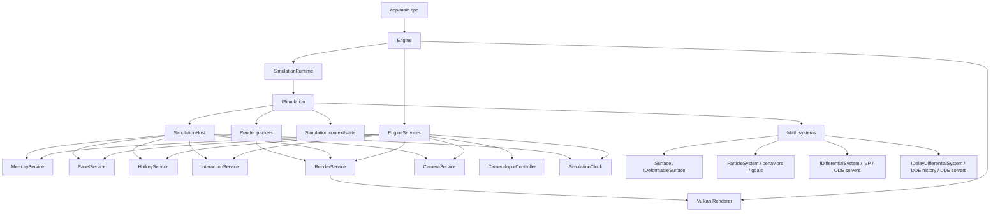
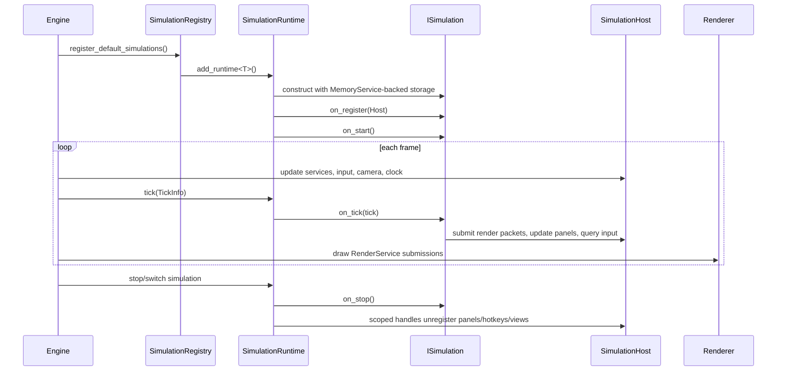
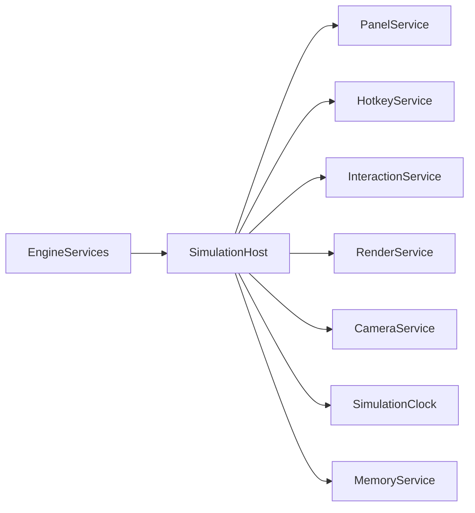
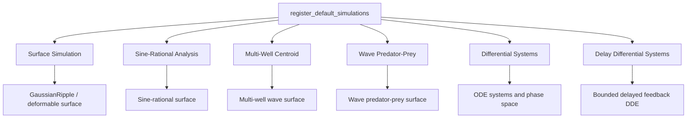
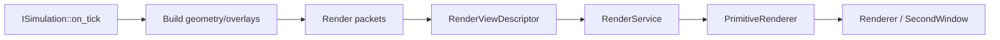
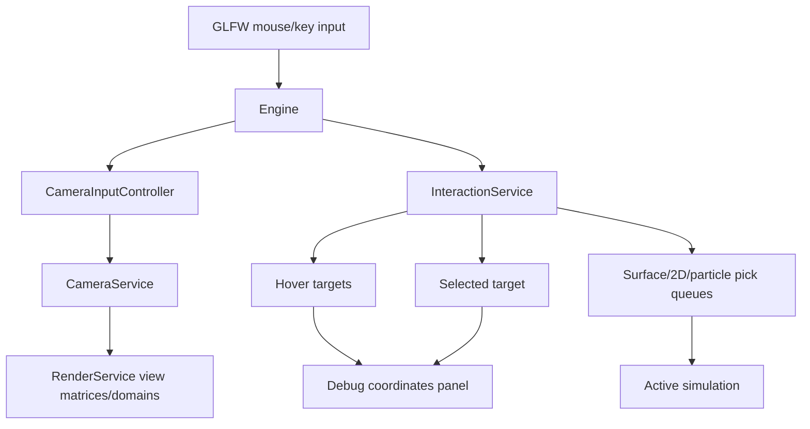
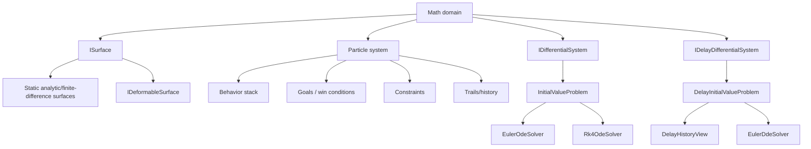
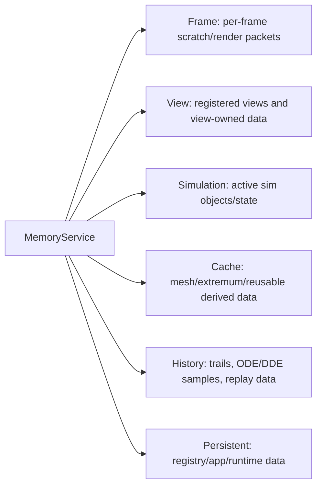

# Current Architecture Diagram

This document describes the current `nurbs_dde` architecture as it exists in
the source tree. It is meant to be a refactor guide and an onboarding map:
where ownership lives, how simulations plug in, and how math data becomes
renderer-submitted geometry.

## Core Principle

```text
Engine owns lifecycle and services.
Simulation owns math state and recalculation.
RenderService owns renderer-neutral view submissions.
Renderer owns Vulkan.
MemoryService owns dynamic allocation policy and lifetime scopes.
```

## System Layers



## Runtime Lifecycle



## Engine Services

`EngineServices` is the engine composition root for service objects. A
simulation does not receive a concrete `Engine`; it receives a narrowed
`SimulationHost` facade with only the services it is allowed to use.



Current service responsibilities:

- `PanelService`: registers global and simulation-specific ImGui panel callbacks.
- `HotkeyService`: registers named key callbacks and owns handle cleanup.
- `InteractionService`: tracks mouse/view hover, selection, surface hits, 2D hits,
  particle/trail hits, and pick queues.
- `RenderService`: owns renderer-neutral view descriptors and packet submission.
- `CameraService`: owns per-view 2D/3D camera state.
- `CameraInputController`: translates raw mouse input into camera commands.
- `SimulationClock`: produces simulation tick data.
- `MemoryService`: central allocation surface for frame, view, simulation, cache,
  history, and persistent lifetimes.

## Simulation Contract

Every first-class simulation implements `ISimulation`:

```cpp
class ISimulation {
public:
    virtual std::string_view name() const = 0;
    virtual void on_register(SimulationHost& host) = 0;
    virtual void on_start() = 0;
    virtual void on_tick(const TickInfo& tick) = 0;
    virtual void on_stop() = 0;
    virtual SceneSnapshot snapshot() const;
    virtual SimulationMetadata metadata() const;
};
```

A simulation is responsible for:

- constructing its surface, equation systems, particles, goals, and panels
- registering panels, hotkeys, render views, and interaction callbacks
- advancing math state during `on_tick`
- submitting draw data through `RenderService`
- exposing `SceneSnapshot` and `SimulationMetadata`
- releasing scoped handles in `on_stop` or destructor-owned cleanup

## Current Simulations

The default registry currently installs:



## Render Flow

Simulations build renderer-neutral geometry and submit it to `RenderService`.
The Vulkan renderer receives only the packet stream and view descriptors.



Typical submitted content:

- surface wireframes and axes
- 2D curve trajectories
- 2D phase-space vector fields
- contour/alternate view packets
- particle markers and trails
- Frenet, normal, binormal, tangent, and osculating overlays
- debug/selection hover markers

## Input, Hover, And Selection



Supported target kinds include:

- surface point
- 2D view point
- particle
- trail sample
- none

Surface simulations can use surface picks for perturbations. Differential
systems can use 2D picks to reset initial conditions.

## Math Stack



All simulation math should route through the project math/numeric layer where
possible. GPU-specific types should stay behind renderer-facing aliases or
conversion boundaries.

## Memory Lifetimes

The engine allocation policy is centralized under `memory::MemoryService`.
Code should request memory by intended lifetime.



Current public surfaces include:

- `memory.frame().make_vector<T>()`
- `memory.view().make_vector<T>()`
- `memory.simulation().make_vector<T>()`
- `memory.cache().make_vector<T>()`
- `memory.history().make_vector<T>()`
- `memory.persistent().make_vector<T>()`
- `memory.<scope>().make_unique<T>()`
- `memory.<scope>().make_unique_as<Base, Derived>()`

See `ALLOCATION_POLICY.md` for the exact rules.

## Current Architectural Notes

- `ISimulation` and `SimulationHost` are now the primary boundary between app
  simulations and engine services.
- `RenderService` is renderer-neutral, but simulation-specific packet builders
  still live in `src/app`.
- Surface, ODE, and DDE math are first-class enough to extend without touching
  Vulkan.
- Global panels and simulation panels both register through `PanelService`, but
  their content is still intentionally simulation-owned.
- Memory ownership is centralized, but policy enforcement is still strongest in
  migrated hot-path/runtime code.
- The current DDE foundation has a fixed-step Euler DDE solver; ODE has Euler
  and RK4.
- New simulations should be registry-driven through `SceneFactories.cpp`.
