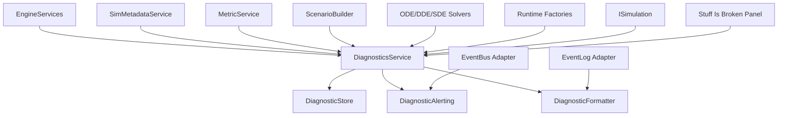

# DiagnosticsService Design

**Status:** design contract  
**Scope:** validation issues, math/runtime errors, trust warnings, and user-facing broken-state reporting  
**Owner:** `EngineServices`  
**Intent:** make correctness failures structured, actionable, queryable, and visible

## Purpose

`DiagnosticsService` is the central sink for things that are wrong, unsafe,
invalid, suspicious, or mathematically untrusted.

It answers:

- What is broken right now?
- Which component or runtime node caused it?
- How severe is it?
- Can the app continue?
- What should the user or developer do next?
- Has this issue been resolved?

Diagnostics are not telemetry and not ordinary logs.

```text
Diagnostics = correctness/trust issues.
Telemetry   = sampled measurements over time.
Logging     = narrative event/history text.
```

Examples:

- invalid NURBS knot vector
- non-positive metric factor
- singular matrix
- missing scenario capability
- DDE history window cannot satisfy `t - tau`
- Markov generator row does not sum to zero
- solver divergence
- duplicate component ID
- unit mismatch
- replay seed missing

## C++ Engineering Standard

Implementation should follow modern C++ best practices as expressed in the C++
Core Guidelines and related industry guidance. The project targets modern C++
in the C++20/C++23 style: prefer clear ownership, RAII, value semantics where
appropriate, strong project scalar aliases, and narrow dependencies.
Use project standard types such as `byte`, `f32`, `f64`, `i32`, `u32`, and `u64`
where they express project-owned domain data. It is acceptable to use native
boundary types such as `int`, `std::size_t`, or external enum/integer types
where the STL, ImGui, GLFW, Vulkan, or another library API expects them.

Prefer the standard vocabulary types available in modern C++20/C++23 when they
make intent explicit: `std::optional` for meaningful absence, `std::expected`
for recoverable fallible operations, and `std::variant` for closed sets of
known runtime categories. These should be favored over sentinel values, loosely
structured status codes, output-parameter error channels, or `dynamic_cast`
where a type-safe result or sum type expresses the contract clearly.

Use the Rule of Zero for ordinary value/config/model types. Use the Rule of
Three or Rule of Five where a type manages ownership, lifetime, polymorphism, or
non-trivial copy/move behavior. Abstract interfaces should make slicing
impossible while still allowing derived types to use appropriate copy/move
semantics.

After major changes and before check-ins, run the normal build/tests and the
clang-tidy build. The tidy build is the guardrail for guideline issues such as
special member function policy:

```powershell
cmake -S . -B cmake-build-tidy -G Ninja -DCMAKE_BUILD_TYPE=Tidy
cmake --build cmake-build-tidy --target nurbs_dde
```

## Ownership

`DiagnosticsService` is owned by the engine through `EngineServices`.

```cpp
class EngineServices {
public:
    DiagnosticsService& diagnostics() noexcept;
};
```

Simulations, metadata validation, metric computation, solvers, factories, and
panels may report to or read from it through service access. They should not own
their own parallel diagnostic stores.

## Dependency Policy

The core diagnostics service should have no heavy exterior dependencies.

Allowed core dependencies:

- standard library containers and strings
- project scalar and ID types
- project descriptor IDs such as `ComponentId` and `RuntimeNodeId`

Avoid in the core service:

- ImGui
- Vulkan
- mp-units
- telemetry storage
- renderer types
- simulation-specific concrete classes

Unit mismatch diagnostics can carry plain structured values and text. Detailed
unit parsing/formatting belongs to `QuantityDisplayService`.

## Architectural Position



## Core Rule

Diagnostics are structured source-of-truth records. Logs and panels are views.

```text
Report once as structured data.
Format many ways for UI, logs, and exports.
```

## Subcomponents

The service may be implemented as a facade over smaller internal components.

### DiagnosticStore

Owns diagnostic records.

Responsibilities:

- assign stable diagnostic IDs
- store active issues
- retain optional resolved history
- support lookup by component, node, severity, and code
- deduplicate repeated frame warnings when configured

### DiagnosticAlerting

Publishes discrete notifications when diagnostic state changes.

Responsibilities:

- emit `DiagnosticRaisedEvent`
- emit `DiagnosticResolvedEvent`
- emit `DiagnosticEscalatedEvent`
- optionally send formatted summaries to the existing event log

Alerting is a bridge. It does not own records.

### DiagnosticFormatter

Turns structured diagnostics into user-facing text.

Responsibilities:

- one-line panel summaries
- detailed issue text
- suggested fix text
- log-friendly text
- future export formatting

Formatting is a view concern. It should not mutate diagnostic records.

### Stuff Is Broken Panel

The diagnostics panel is a consumer.

Responsibilities:

- show active errors/warnings
- group by severity, component, node, or subsystem
- show suggested fixes
- provide copy/export buttons later
- optionally allow manual resolve/acknowledge for non-fatal issues

It must not be the only place where diagnostics are created or validated.

## Severity

```cpp
enum class DiagnosticSeverity {
    Info,
    Warning,
    Error,
    Fatal
};
```

Meanings:

- `Info`: noteworthy but not wrong
- `Warning`: suspicious or incomplete; app can continue
- `Error`: invalid state or failed operation; affected feature should stop
- `Fatal`: unrecoverable for the current simulation or app

## Lifetime

```cpp
enum class DiagnosticLifetime {
    Frame,
    UntilResolved,
    Scenario,
    Application
};
```

Meanings:

- `Frame`: transient warning; cleared by `clear_frame_diagnostics()`
- `UntilResolved`: stays active until explicitly resolved or replaced
- `Scenario`: cleared when active simulation/scenario changes
- `Application`: persists for app lifetime

Examples:

- hover chart sample failed: `Frame`
- invalid scenario graph: `UntilResolved`
- solver diverged in active scenario: `Scenario`
- missing dependency at startup: `Application`

## Error Codes

```cpp
enum class ErrorCode {
    Unknown,

    DuplicateComponentId,
    MissingDescriptor,
    MissingFactory,
    MissingCapability,
    InvalidParameter,
    UnitMismatch,

    ChartOutOfDomain,
    SingularMetric,
    NonPositiveMetric,
    SingularMatrix,
    NoCutLocusCrossingViolated,

    SolverDiverged,
    StepSizeTooLarge,
    DDEHistoryUnavailable,
    DDEHistoryWindowTooShort,

    KnotVectorInvalid,
    NURBSWeightsInvalid,
    ContinuityViolation,

    MarkovTransitionInvalid,
    GeneratorRowsDoNotSumToZero,
    NegativeTransitionRate,
    AbsorbingStateUnreachable,

    ReplaySeedMissing,
    MissingCapabilityForTelemetry,
    ThreadFault,
    ExternalDependencyUnavailable
};
```

Error codes should be stable enough for tests and panels to filter on them.

## Stable IDs

```cpp
struct DiagnosticId {
    u64 value = 0;
};

struct ComponentId {
    std::string value;
};

struct RuntimeNodeId {
    u64 value = 0;
};
```

`DiagnosticId` is assigned by `DiagnosticsService`. Component and runtime node
IDs come from the metadata/scenario systems.

## Source And Context

```cpp
enum class DiagnosticSubsystem {
    Engine,
    Metadata,
    Scenario,
    Metric,
    Field,
    Particle,
    Solver,
    DDEHistory,
    Markov,
    NURBS,
    Telemetry,
    Renderer,
    Threading,
    Replay,
    Unknown
};

struct DiagnosticSource {
    DiagnosticSubsystem subsystem = DiagnosticSubsystem::Unknown;
    std::optional<ComponentId> component;
    std::optional<RuntimeNodeId> node;
    std::string location;
};
```

`location` is a lightweight human/debug string such as:

```text
ScenarioBuilder::build
MetricService::inverse_metric
PlanarNBodyGravitySystem::evaluate
```

## Payloads

Diagnostics should support simple structured payloads without becoming a
telemetry service.

```cpp
using DiagnosticValue = std::variant<
    bool,
    i64,
    f64,
    std::string
>;

struct DiagnosticFact {
    std::string key;
    DiagnosticValue value;
};
```

Examples:

```text
metric_factor = -0.02
epsilon = 0.15
amplitude = 12.0
row_index = 3
row_sum = 0.002
```

## Diagnostic Record

```cpp
struct Diagnostic {
    DiagnosticId id;
    DiagnosticSeverity severity = DiagnosticSeverity::Warning;
    DiagnosticLifetime lifetime = DiagnosticLifetime::UntilResolved;
    ErrorCode code = ErrorCode::Unknown;

    DiagnosticSource source;

    std::string title;
    std::string message;
    std::string suggested_fix;

    std::vector<DiagnosticFact> facts;

    f64 first_seen_seconds = 0.0;
    f64 last_seen_seconds = 0.0;
    u64 occurrence_count = 1;

    bool active = true;
    bool acknowledged = false;
};
```

Time fields use engine wall/sim display time initially. They can later be
replaced with a project time abstraction if needed.

## Report Input

Callers should report a request, not manually assign IDs.

```cpp
struct DiagnosticReport {
    DiagnosticSeverity severity = DiagnosticSeverity::Warning;
    DiagnosticLifetime lifetime = DiagnosticLifetime::UntilResolved;
    ErrorCode code = ErrorCode::Unknown;

    DiagnosticSource source;

    std::string title;
    std::string message;
    std::string suggested_fix;

    std::vector<DiagnosticFact> facts;
};
```

## Service API

```cpp
class DiagnosticsService {
public:
    DiagnosticId report(DiagnosticReport report);

    void resolve(DiagnosticId id);
    void resolve_for(ComponentId component);
    void acknowledge(DiagnosticId id);

    void clear_frame_diagnostics();
    void clear_scenario_diagnostics();
    void clear_all();

    std::span<const Diagnostic> active() const;
    std::span<const Diagnostic> history() const;

    std::vector<Diagnostic> active_for(ComponentId component) const;
    std::vector<Diagnostic> active_for(RuntimeNodeId node) const;
    std::vector<Diagnostic> active_with(ErrorCode code) const;
    std::vector<Diagnostic> active_at_or_above(DiagnosticSeverity severity) const;

    bool has_errors() const;
    bool has_fatal() const;
};
```

Implementation note: return-by-vector is acceptable for filtered queries at
first. Diagnostic volume should be low. Optimize only after profiling.

## Deduplication

Repeated diagnostics should update occurrence count rather than flooding the
panel.

Suggested dedupe key:

```text
severity + code + component + node + title + location
```

On duplicate:

- update `last_seen_seconds`
- increment `occurrence_count`
- keep original `first_seen_seconds`
- preserve active state

Frame diagnostics may dedupe only within the current frame.

## Validation Reports

`ValidationReport` is a batch of issues before they enter the active diagnostic
store.

```cpp
struct ValidationIssue {
    DiagnosticSeverity severity;
    ErrorCode code;
    DiagnosticSource source;
    std::string message;
    std::string suggested_fix;
    std::vector<DiagnosticFact> facts;
};

struct ValidationReport {
    std::vector<ValidationIssue> issues;

    bool ok() const;
    bool has_errors() const;
    bool has_warnings() const;
};
```

The diagnostics service can consume it:

```cpp
void report(ValidationReport report);
```

This is useful for `SimMetadataService::validate_scenario`.

## Events

Diagnostics may publish discrete events through an adapter.

```cpp
struct DiagnosticRaisedEvent {
    DiagnosticId id;
    DiagnosticSeverity severity;
    ErrorCode code;
    DiagnosticSource source;
    std::string title;
};

struct DiagnosticResolvedEvent {
    DiagnosticId id;
    ErrorCode code;
    DiagnosticSource source;
};

struct DiagnosticEscalatedEvent {
    DiagnosticId id;
    DiagnosticSeverity from;
    DiagnosticSeverity to;
};
```

Events are optional integration points. The core service should work without an
event bus.

## Logging Integration

The existing logging/event-log system should consume diagnostics through a
formatter.

Example log output:

```text
[DIAGNOSTIC/Error] Metric factor became non-positive (field.metric_ripple)
  fix: Reduce epsilon or amplitude.
```

Logging is not the diagnostic source of truth. It is a display/export surface.

## Telemetry Integration

Telemetry should not store diagnostics. However, diagnostics may reference
telemetry streams in facts or messages.

Example:

```text
Diagnostic:
  code: NonPositiveMetric
  facts:
    stream = "agent.3.metric.factor"
    latest_value = -0.02
```

Telemetry can later add counters such as:

```text
diagnostics.active_errors
diagnostics.active_warnings
```

Those counters are telemetry derived from diagnostics, not diagnostics
themselves.

## SimMetadataService Integration

`SimMetadataService` reports diagnostics for:

- duplicate component IDs
- missing descriptors
- missing factories
- invalid parameter schemas
- scenario graph port mismatches
- missing capabilities
- unit mismatch in component config

Example:

```cpp
diagnostics.report(DiagnosticReport{
    .severity = DiagnosticSeverity::Error,
    .lifetime = DiagnosticLifetime::UntilResolved,
    .code = ErrorCode::MissingCapability,
    .source = {
        .subsystem = DiagnosticSubsystem::Metadata,
        .component = ComponentId{"behavior.metric_brownian"},
        .location = "SimMetadataService::validate_scenario"
    },
    .title = "Required metric capability is missing",
    .message = "Metric-aware Brownian motion requires an inverse metric tensor provider.",
    .suggested_fix = "Connect the behavior to a surface or metric component that provides InverseMetricTensor."
});
```

## MetricService Integration

`MetricService` reports diagnostics for:

- metric singularity
- non-positive determinant
- chart point outside domain
- failed Christoffel computation
- geodesic approximation failure

Metric diagnostics should usually be `Frame` or `UntilResolved` depending on
whether the invalid value is transient sampling or persistent configuration.

## Solver Integration

ODE/DDE/SDE solvers report diagnostics for:

- divergence
- NaN/Inf state
- too-large timestep
- missing DDE history
- history interpolation failure

Solvers should return `MathResult<T>` where possible and report diagnostics at
the boundary where the error affects the running scenario.

## NURBS Integration

NURBS validation reports:

- degree less than one
- mismatched control point and weight counts
- non-positive weights
- nondecreasing knot vector violation
- knot vector size mismatch
- continuity warning

## Markov Integration

Markov validation reports:

- transition to unknown state
- negative off-diagonal rate
- diagonal rate positive
- row sum not zero
- unreachable initial state
- invalid forced transition

## Threading Integration

When threading arrives, worker threads should not mutate UI state. They may
report diagnostics through one of two paths:

1. a thread-safe queue consumed by the engine thread
2. a `DiagnosticsMailbox` for latest fatal/thread issues

The first implementation can remain single-threaded.

## Stuff Is Broken Panel

Panel name: `Stuff Is Broken`

Panel sections:

- Fatal
- Errors
- Warnings
- Info
- Resolved history, collapsed by default

Each row should show:

- severity
- subsystem
- title
- component/node if present
- occurrence count
- suggested fix

Controls:

- acknowledge
- resolve, when safe
- copy diagnostic details
- clear frame warnings

The panel should be globally registered by the engine, not by a simulation.

## Storage Policy

Suggested initial storage:

```cpp
class DiagnosticStore {
    std::vector<Diagnostic> m_active;
    std::vector<Diagnostic> m_history;
    u64 m_next_id = 1;
};
```

This is enough for current expected volume. If diagnostics become high volume,
add bounded history limits and indexing.

## Migration Plan

### Phase 1: Core Service

- Add `DiagnosticsService`
- Add diagnostic enums and record structs
- Add report/resolve/query methods
- Own service in `EngineServices`
- Add unit tests for report, dedupe, resolve, and filtering

### Phase 2: Metadata Validation

- Make `SimMetadataService` return `ValidationReport`
- Add adapter to report validation issues into diagnostics
- Add duplicate component ID diagnostics

### Phase 3: Panel

- Add global `Stuff Is Broken` panel
- Show active diagnostics grouped by severity
- Add clear frame warnings

### Phase 4: Math And Runtime Producers

- Wire `MetricService`
- Wire NURBS validation
- Wire Markov validation
- Wire solver failure reporting
- Wire scenario graph validation

### Phase 5: Logging/Event Bridges

- Add diagnostic raised/resolved events
- Add event-log formatting adapter
- Keep core diagnostics independent

## Acceptance Tests

Required early tests:

- reporting a diagnostic returns a nonzero ID
- active diagnostics include reported diagnostic
- duplicate diagnostics increment occurrence count
- resolving a diagnostic removes it from active list
- resolved diagnostic appears in history
- filtering by severity works
- filtering by component works
- frame diagnostics clear on frame clear
- scenario diagnostics clear on scenario clear

Required integration tests:

- metadata duplicate ID creates diagnostic
- invalid scenario config creates validation diagnostics
- `Stuff Is Broken` panel can read active diagnostics without owning them

## Open Questions

- Should acknowledged diagnostics remain in active results by default?
- Should `Fatal` diagnostics request engine shutdown or only simulation stop?
- Should diagnostic history be persisted to disk?
- Should diagnostics support parent/child relationships for batch validation?
- Should repeated diagnostics escalate severity after a threshold?

## First Implementation Target

```text
DiagnosticsService exists.
EngineServices owns it.
Callers can report, resolve, and query active diagnostics.
The service has no ImGui, Vulkan, telemetry, or mp-units dependency.
Tests prove report/dedupe/resolve/filter behavior.
```
