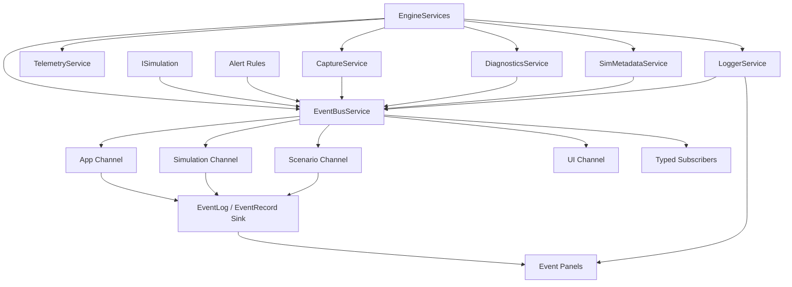

# EventBusService Design

**Status:** design contract  
**Scope:** typed discrete event routing, compact event recording, event log views, and service-level subscription ownership  
**Owner:** `EngineServices`  
**Intent:** make runtime happenings structured, routed, inspectable, and distinct from telemetry, diagnostics, and ordinary logs

## Purpose

`EventBusService` is the central routing service for discrete happenings in the
engine and active simulations.

It answers:

- What happened?
- Which component emitted it?
- Who needs to react to it?
- Should this event also appear in an event log panel?
- Was this event scoped to the app, scenario, simulation, view, or capture run?
- Did subscribers receive it synchronously, or was it queued for frame-end drain?

Events are not telemetry, diagnostics, resource metadata, or ordinary logs.

```text
Events      = discrete happenings.
Telemetry   = sampled numeric/state measurements over time.
Diagnostics = correctness/trust issues.
Resources   = lookup tables for files, paths, artifacts, names, and external handles.
Logging     = formatted narrative text for humans.
```

Examples:

- scenario started
- agent spawned
- agent captured
- perturbation fired
- metric ripple decayed
- Markov transition happened
- spline knot changed
- capture requested
- capture artifact written
- worker thread faulted
- diagnostics issue reported

The event payload should carry the fact and stable identifiers. It should not
carry owned strings, file paths, formatted messages, or large payloads. If an
event says "capture artifact written", it should carry an artifact/resource ID;
`CaptureService` or a future `ResourceManager` answers what path that ID maps
to. If a panel needs human narrative text, it asks `LoggerService`, not the
event bus.

## C++ Engineering Standard

Implementation should follow modern C++ best practices as expressed in the C++
Core Guidelines and related industry guidance. The project targets modern C++
in the C++20/C++23 style: prefer clear ownership, RAII, value semantics where
appropriate, strong project scalar aliases, and narrow dependencies.
Use project standard types such as `byte`, `f32`, `f64`, `i32`, `u32`, and
`u64` where they express project-owned domain data. It is acceptable to use
native boundary types such as `int`, `std::size_t`, or external enum/integer
types where the STL, ImGui, GLFW, Vulkan, or another library API expects them.

Prefer the standard vocabulary types available in modern C++20/C++23 when they
make intent explicit: `std::optional` for meaningful absence, `std::expected`
for recoverable fallible operations, and `std::variant` for closed sets of
known runtime categories. These should be favored over sentinel values, loosely
structured status codes, output-parameter error channels, or `dynamic_cast`
where a type-safe result or sum type expresses the contract clearly.

Use the Rule of Zero for ordinary value/config/model types. Use the Rule of
Three or Rule of Five where a type manages ownership, lifetime, polymorphism, or
non-trivial copy/move behavior. Abstract interfaces should make slicing
impossible while still allowing derived types to use appropriate copy/move
semantics.

After major changes and before check-ins, run the normal build/tests and the
clang-tidy build. The tidy build is the guardrail for guideline issues such as
special member function policy:

```powershell
cmake -S . -B cmake-build-tidy -G Ninja -DCMAKE_BUILD_TYPE=Tidy
cmake --build cmake-build-tidy --target nurbs_dde
```

## Current State

The project already has event infrastructure:

- `events::EventBus`: typed synchronous dispatch with typed subscriptions
- `events::EventRing`: fixed-size SPSC ring for compact records
- `events::EventRecord`: 128-byte trivially copyable event record
- `events::EventLog`: owns ring storage and formats records for UI display
- engine-scoped event structs in `simulation/events/EngineEventTypes.hpp`
- simulation-scoped event structs in `simulation/events/SimEventTypes.hpp`
- alert rules that push `EventRecord` values directly

`EventBusService` should evolve these existing pieces. It should not replace
them with a string-only or reflection-heavy event system.

The current typed dispatch implementation uses per-event typed subscriber
lists. It does not use `std::any` or allocate on dispatch. Subscriber storage is
allocated when subscribing, which is acceptable because subscription changes are
not the simulation hot path.

## Ownership

`EventBusService` is owned by the engine through `EngineServices`.

```cpp
class EngineServices {
public:
    EventBusService& events() noexcept;
};
```

The service owns app-lifetime event routing and can create scenario/simulation
scoped channels. Individual simulations may receive a view of the service
through `SimulationHost`.

```cpp
class SimulationHost {
public:
    EventBusService& events() const noexcept;
};
```

Short-lived subscriptions should be owned by RAII handles. Simulations and UI
panels should not need to remember manual unsubscribe calls during normal
shutdown.

## Architectural Position



## Non-Goals

`EventBusService` must not:

- replace telemetry streams
- store every particle sample
- become a general message queue for large payloads
- carry owned strings, filesystem paths, JSON, blobs, or formatted messages
- require heap allocation on hot-path simulation events
- perform expensive formatting during dispatch
- hide diagnostics inside event text
- own active simulation state
- make event delivery order depend on UI panel draw order

## Service Boundaries

### Events

Events are typed structs representing something that happened at one point in
logical time.

```cpp
struct AgentCapturedEvent {
    u64 pursuer_id = u64(0);
    u64 prey_id = u64(0);
    f32 distance = f32(0);
    f32 sim_time = f32(0);
    u64 tick = u64(0);
};
```

### Payload Boundary

Event payloads are intentionally small and bounded. The event bus carries IDs,
project scalar types, enums, compact coordinates, ticks, sequence numbers, and
other values needed for routing or immediate reactions.

The event bus does not carry:

- owned `std::string` values
- borrowed `std::string_view` names or paths as semantic payloads
- `std::filesystem::path` values
- large arrays, image buffers, packet blobs, or JSON documents
- fully formatted user-facing text
- arbitrary payload variants that can grow without a fixed policy

Those details live behind service APIs:

- `CaptureService`: `CaptureArtifactId` or `ResourceId` -> file path,
  dimensions, target window, manifest entry, capture session
- `TelemetryService`: `TelemetryRunId` -> CSV path, stream schema, counters
- `SimMetadataService`: `ComponentId`, `RuntimeNodeId`, or `EventTypeId` ->
  display name, docs path, descriptor, capabilities
- `DiagnosticsService`: `DiagnosticId` -> severity, message, facts,
  suggested fixes, lifecycle state
- future `ResourceManager`: `ResourceId` or `FileId` -> path, lifetime,
  origin, owner service, persistence policy
- future `LoggerService`: `LogRecordId` or event reference -> formatted text,
  string storage, sinks, filtering, export

This keeps hot events stable and cheap while still allowing rich UI and file
output through the services that own that richer data.

During migration, `runtime_node_id_from_text()` may be used to derive stable
runtime IDs from existing scenario, recipe, or field names. That is a bridge,
not the final source of truth. The long-term source should be registered
metadata/resource IDs.

### Telemetry

Telemetry is sampled state over time. Do not publish one event per particle per
tick merely to record a trajectory. Use `TelemetryService` for that.

### Diagnostics

Diagnostics are durable correctness and trust issues. A diagnostic may publish
a discrete event such as `DiagnosticReportedEvent`, but the source of truth is
still `DiagnosticsService`.

### Logging

Logs are formatted text and narrative history. Formatting belongs in
`LoggerService`, `EventLog` display adapters, or file writers, not in the hot
dispatch path.

`EventLog` remains a compact event-record view for panels and debugging. It is
not the general-purpose string store. When a user-facing log line needs more
than a short inline label, the logger owns the string storage and can reference
the event by channel, sequence, tick, event type, and related resource IDs.

## Core Concepts

### Event Scope

```cpp
enum class EventScope : u8 {
    App,
    Scenario,
    Simulation,
    View,
    Capture,
    Worker
};
```

Scope describes the lifetime and intended audience of an event.

- `App`: engine startup/shutdown, global config, simulation switching
- `Scenario`: scenario graph loaded, validation complete, reset
- `Simulation`: agent/field/solver events during a run
- `View`: camera/view interaction, capture-ready frame
- `Capture`: still capture and frame-sequence artifacts
- `Worker`: background job started/stopped/faulted

### Event Channel

An event channel owns typed subscribers and one optional compact record sink.

```cpp
enum class EventChannelId : u8 {
    App,
    Scenario,
    Simulation,
    Ui,
    Worker
};
```

The initial implementation may use one app channel and one active simulation
channel. The API should leave room for per-scenario and worker channels.

### Subscription

```cpp
struct SubscriptionId {
    u64 value = u64(0);

    friend constexpr bool operator==(SubscriptionId, SubscriptionId) noexcept = default;
};
```

`Subscription` is an RAII handle. Destroying it unsubscribes from the channel.

```cpp
class Subscription {
public:
    Subscription() = default;
    ~Subscription();

    Subscription(const Subscription&) = delete;
    Subscription& operator=(const Subscription&) = delete;
    Subscription(Subscription&&) noexcept;
    Subscription& operator=(Subscription&&) noexcept;

    void reset() noexcept;
    [[nodiscard]] bool active() const noexcept;
};
```

### Event Record

`EventRecord` is the compact display/logging representation. It should stay
fixed-size, trivially copyable, and ring-buffer friendly. It is not a complete
replacement for typed events.

Existing record constraints should remain:

- fixed record size
- no heap allocation
- project scalar aliases
- short inline label only; the label is a hint, not the source of truth
- formatter runs outside dispatch

`EventRecord` may include a short label because the current UI needs a compact
hint. The label must not become the data contract. It should be replaceable by
IDs plus logger/resource lookup.

### Event Descriptor

`SimMetadataService` describes event types so panels and scenario tooling can
discover them without relying on string payloads in events.

```cpp
struct EventDescriptor {
    EventTypeId id;
    std::string display_name;
    EventScope scope = EventScope::Simulation;
    DiagnosticSeverity default_severity = DiagnosticSeverity::Info;
    ComponentId producer = ids::unknown_component;
    DocumentationRef docs;
};
```

## Public API

```cpp
class EventBusService {
public:
    EventBusService() = default;
    ~EventBusService();

    EventBusService(const EventBusService&) = delete;
    EventBusService& operator=(const EventBusService&) = delete;
    EventBusService(EventBusService&&) = delete;
    EventBusService& operator=(EventBusService&&) = delete;

    void init(EventBusConfig config);
    void shutdown() noexcept;

    template <class Event>
    [[nodiscard]] Subscription subscribe(EventChannelId channel,
                                         std::function<void(const Event&)> handler);

    template <class Event>
    void publish(EventChannelId channel, const Event& event);

    template <class Event>
    void publish(EventChannelId channel,
                 const Event& event,
                 const events::EventRecord& record);

    void drain(EventChannelId channel, f32 sim_time, u64 tick);
    void reset_channel(EventChannelId channel) noexcept;
    void clear_scenario_channels() noexcept;

    [[nodiscard]] events::EventLog& log(EventChannelId channel) noexcept;
    [[nodiscard]] const events::EventLog& log(EventChannelId channel) const noexcept;
};
```

## Configuration

```cpp
struct EventChannelConfig {
    EventChannelId channel = EventChannelId::Simulation;
    u64 ring_capacity_records = u64(4096);
    u64 max_display_records = u64(512);
    bool record_to_log = true;
};

struct EventBusConfig {
    std::vector<EventChannelConfig> channels;
};
```

Defaults:

- app channel: 2048 records, 512 display entries
- simulation channel: 4096 records, 1024 display entries
- worker channel: 512 records, 256 display entries

## Event Examples

### Scenario Events

```cpp
struct ScenarioLoadedEvent {
    RuntimeNodeId scenario = {};
    RuntimeNodeId root_node = {};
    EventTypeId event_type = {};
};

struct ScenarioValidatedEvent {
    RuntimeNodeId scenario = {};
    u64 warning_count = u64(0);
    u64 error_count = u64(0);
};
```

### Simulation Events

```cpp
struct MarkovTransitionEvent {
    u64 agent_id = u64(0);
    RuntimeNodeId from_state;
    RuntimeNodeId to_state;
    RuntimeNodeId trigger = {};
    f32 sim_time = f32(0);
    u64 tick = u64(0);
};

struct MarkovDwellEvent {
    u64 agent_id = u64(0);
    RuntimeNodeId state;
    f32 dwell_seconds = f32(0);
    f32 sim_time = f32(0);
    u64 tick = u64(0);
};
```

### Geometry Events

```cpp
struct SplineKnotChangedEvent {
    RuntimeNodeId spline;
    u32 knot_index = u32(0);
    f64 new_value = f64(0);
};
```

### Capture Events

```cpp
struct CaptureArtifactWrittenEvent {
    CaptureArtifactId artifact = {};
    CaptureTarget target = CaptureTarget::MainWindow;
    u32 width = u32(0);
    u32 height = u32(0);
    u64 tick = u64(0);
    f32 sim_time = f32(0);
};
```

### Worker Events

```cpp
struct ThreadFaultEvent {
    RuntimeNodeId worker = {};
    DiagnosticId diagnostic = {};
    DiagnosticSeverity severity = DiagnosticSeverity::Error;
};
```

## Dispatch Contract

Typed dispatch should preserve the current hot-path behavior:

1. Call typed subscribers synchronously.
2. Push a compact `EventRecord` into the attached ring when recording is enabled.
3. Do not format text during dispatch.
4. Do not allocate during common simulation event dispatch.
5. Do not hold locks while invoking subscribers.
6. Do not copy strings, paths, or variable-sized payloads through dispatch.
7. Do not create subscriber lists during dispatch for event types with no
   subscribers.

Subscribers must be fast. Long work belongs in explicit worker systems.

## Ordering

Within one channel, events are observed in publish order.

Across different channels, no global ordering guarantee is required. Panels that
need a merged view can merge by `(tick, sim_time, sequence_number)` after drain.

`EventBusService` assigns a monotonic per-channel sequence to records published
through the service. The sequence is stored in `EventRecord::sequence` and is
available for future logger/resource references.

```cpp
struct EventRecord {
    // ...
    u64 sequence = u64(0);
};
```

Publishing through a raw `events::EventBus` bypasses service sequencing and
should be treated as a legacy/internal escape hatch. Scenario construction has
been migrated to publish through `EventBusService`.

## Threading

Initial contract:

- simulation events publish on the simulation/main tick thread
- UI subscriptions are registered/unregistered on the main thread
- event log drain runs once per frame on the main thread
- worker threads publish compact records through the worker mailbox

Do not let arbitrary background threads call the simulation hot-path channel
directly unless the channel has been made MPSC-safe.

Current worker channel:

```text
worker thread -> EventBusService::enqueue_worker_record()
main thread   -> EventBusService::drain_worker_mailbox()
main thread   -> EventLog::drain()
```

The worker mailbox accepts compact `EventRecord` values only. It is not a typed
cross-thread dispatch mechanism and it does not carry strings or paths.

## Event Log Integration

Each channel may have an `EventLog` sink. The sink owns:

- ring slab
- display entries
- drain scratch buffer
- dropped-event accounting

`EventBusService::drain()` should call `EventLog::drain()` for configured
channels.

Panels should read log entries from the service rather than from ad hoc
simulation-owned logs once migration is complete.

The event log is not the final human logging system. It is the compact event
record view. `LoggerService` owns human log messages, string storage, category
filtering, file sinks, and rich formatting.

## Logger Integration

`LoggerService` may subscribe to selected event channels and produce narrative
records for human readers. The logger should be the service that stores larger
strings and formats records such as:

- `Capture artifact 2134 written to captures/.../main_000120.png`
- `Diagnostic 83 reported by solver.ode.rk4`
- `Scenario 12 started with seed 9162`

Those strings should not be republished as event payloads. The logger stores
them in its own bounded slabs or files and associates them with compact event,
resource, component, and diagnostic IDs.

## Diagnostics Integration

Diagnostics can publish events for visibility:

- `DiagnosticReportedEvent`
- `DiagnosticResolvedEvent`
- `DiagnosticAcknowledgedEvent`

But diagnostics remain the source of truth for active issues. Event logs may
show a short record; the "Stuff Is Broken" panel reads `DiagnosticsService`.

If event publication fails because of capacity, the service should report a
diagnostic only when the failure is persistent or severe. Normal event ring
drops should be represented by `EventsDropped` records and counters.

## Telemetry Integration

Telemetry may subscribe to rare events that define intervals or annotations,
such as:

- scenario started
- scenario stopped
- capture artifact written
- Markov transition
- capture pending alert

Telemetry must not subscribe to event streams as a substitute for per-tick data
recording.

## Metadata Integration

`SimMetadataService` can register `EventDescriptor` values for components that
publish events.

Examples:

- `simulation.wave_predator_prey` publishes `AgentCapturedEvent`
- `field.metric_ripple` publishes `FieldAddedEvent` and `FieldRemovedEvent`
- `system.markov_chain` publishes `MarkovTransitionEvent`
- `service.capture` publishes `CaptureArtifactWrittenEvent`

## Capture Integration

`CaptureService` should publish:

- `CaptureRequestedEvent`
- `CaptureArtifactWrittenEvent`
- `MovieFrameSequenceStartedEvent`
- `MovieFrameSequenceStoppedEvent`

MP4 conversion remains offline in `tools/Convert-ToMp4.ps1`; the app should not
publish MP4 conversion progress unless a future in-app tool runner is added.

Capture events should carry capture artifact/session IDs, not paths. The path,
dimensions, manifest, and window target are retrieved from `CaptureService` or
a future `ResourceManager`.

## Migration Plan

1. Add `EventBusService` under `src/engine/events`.
2. Move engine-owned `m_engine_bus` and `m_engine_log` into the service.
3. Expose `events()` from `EngineServices` and `SimulationHost`.
4. Adapt existing `events::EventBus` as the internal typed channel
   implementation.
5. Adapt existing `events::EventLog` as the channel log sink.
6. Route app lifecycle events through the service.
7. Route active simulation events through a simulation channel.
8. Replace direct engine calls to sim-owned event logs with service drain.
9. Add event descriptors to `SimMetadataService`.
10. Add capture and diagnostics event adapters.
11. Replace string/path event payloads with IDs and service lookup.
    Initial cleanup has removed owned/buffered strings and semantic string
    views from app/simulation typed events; remaining string use belongs to
    `EventRecord` display hints, `EventLog` formatted UI text, or
    `LoggerService`.
12. Move rich text output into `LoggerService`.
13. Assign per-channel sequences in `EventBusService`.
14. Add a worker mailbox for compact worker records.

## Unit Test Targets

- typed subscriber receives the published event
- unsubscribed handle stops receiving events
- move-only subscription handle unsubscribes exactly once
- publish with record writes to the configured event log ring
- drain formats records and preserves order
- event ring drop count produces an `EventsDropped` record
- app and simulation channels are isolated
- clearing scenario channels does not clear app-lifetime subscribers
- worker-channel mailbox rejects overflow or reports drops
- service follows Rule of Five policy for ownership types
- hot-path event types stay bounded and do not own strings or paths
- dispatch of unsubscribed event types does not allocate or mutate subscriber
  maps
- typed dispatch does not use `std::any`
- logger/resource lookup can resolve IDs emitted by event payloads
- service-published records receive monotonic per-channel sequence numbers
- worker mailbox accepts, drains, and reports overflow for compact records

## Open Decisions

- Should every event type have a mandatory `EventDescriptor` before it can be
  published? The registry exists now, but publishing is not yet gated on it.
- Should the final implementation use one shared channel map or strongly typed
  channel objects?
- Should simulation events remain synchronous, or should some subscribers opt
  into deferred delivery?
- Should event records use `byte` labels eventually, or keep `char` where
  null-terminated text is the right representation?
- How much event history should be persisted to disk separate from telemetry?
- What is the exact maximum size and trait policy for hot-path typed events?
- Should `ResourceId` live in `RuntimeIds.hpp` now or wait for
  `ResourceManager`?

