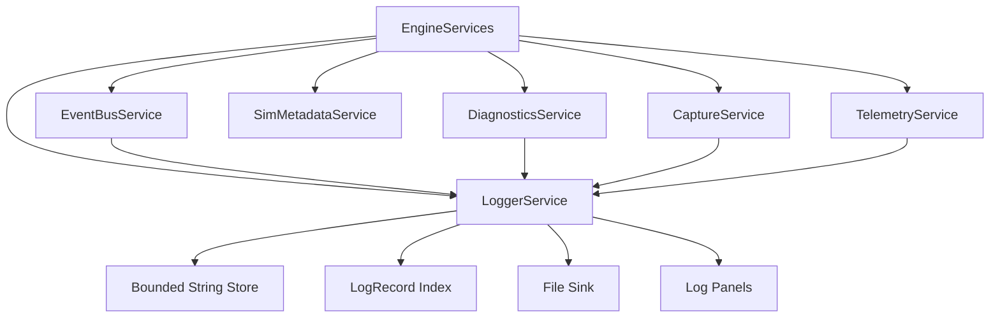

# LoggerService Design

**Status:** design contract  
**Scope:** human-readable log records, string storage, formatting, log panels, file sinks, and event/diagnostic/resource narration  
**Owner:** `EngineServices`  
**Intent:** give narrative text a dedicated service so events, telemetry, diagnostics, and metadata stay structured

## Purpose

`LoggerService` owns human-readable runtime history.

It answers:

- What should a developer or user read when something notable happens?
- Which log records should appear in the UI?
- Which log records should be written to disk?
- How are rich messages formatted from event, diagnostic, metadata, telemetry,
  and resource IDs?
- How much string data is retained in memory?
- Which records are dropped when a bounded log buffer fills?

The logger is not the event bus, telemetry service, diagnostics service, or
metadata registry.

```text
LoggerService = formatted narrative text for humans.
EventBus      = compact typed happenings and IDs.
Telemetry     = sampled numeric/state measurements over time.
Diagnostics   = correctness/trust issues and active broken-state records.
Metadata      = descriptors for components, scenarios, streams, and events.
Resources     = files, paths, artifacts, manifests, and external handles.
```

Examples:

- `Engine started with default config`
- `Scenario 12 started with seed 9162`
- `Capture artifact 2134 written to captures/.../main_000120.png`
- `Diagnostic 83 reported by solver.ode.rk4`
- `Event channel Simulation dropped 7 records`
- `Telemetry run 4 wrote 37716 rows`

## C++ Engineering Standard

Implementation should follow modern C++ best practices as expressed in the C++
Core Guidelines and related industry guidance. The project targets modern C++
in the C++20/C++23 style: prefer clear ownership, RAII, value semantics where
appropriate, strong project scalar aliases, and narrow dependencies.
Use project standard types such as `byte`, `f32`, `f64`, `i32`, `u32`, and `u64`
where they express project-owned domain data. It is acceptable to use native
boundary types such as `int`, `std::size_t`, `char`, `std::string`, or external
enum/integer types where the STL, ImGui, GLFW, Vulkan, filesystem APIs, or
another library API expects them.

Prefer the standard vocabulary types available in modern C++20/C++23 when they
make intent explicit: `std::optional` for meaningful absence, `std::expected`
for recoverable fallible operations, and `std::variant` for closed sets of
known runtime categories. These should be favored over sentinel values, loosely
structured status codes, output-parameter error channels, or `dynamic_cast`
where a type-safe result or sum type expresses the contract clearly.

Use the Rule of Zero for ordinary value/config/model types. Use the Rule of
Three or Rule of Five where a type manages ownership, lifetime, polymorphism, or
non-trivial copy/move behavior. Abstract interfaces should make slicing
impossible while still allowing derived types to use appropriate copy/move
semantics.

After major changes and before check-ins, run the normal build/tests and the
clang-tidy build. The tidy build is the guardrail for guideline issues such as
special member function policy:

```powershell
cmake -S . -B cmake-build-tidy -G Ninja -DCMAKE_BUILD_TYPE=Tidy
cmake --build cmake-build-tidy --target nurbs_dde
```

## Ownership

`LoggerService` is owned by the engine through `EngineServices`.

```cpp
class EngineServices {
public:
    LoggerService& logger() noexcept;
};
```

The engine owns the logger because it owns service lifetime, frame boundaries,
shutdown order, and application-wide file locations. Simulations, services, and
panels may write records through service access, but should not own independent
long-lived text log systems.

## Architectural Position



## Non-Goals

`LoggerService` must not:

- replace `EventBusService` typed dispatch
- become a source of truth for diagnostics
- store per-tick telemetry samples
- own file/resource metadata that belongs to capture or resource management
- run expensive formatting in simulation hot paths
- require events to carry strings or paths
- make simulation correctness depend on whether a panel is visible

## Core Boundary

Events carry compact facts and IDs. The logger turns those facts and IDs into
text when text is useful.

For example:

```cpp
struct CaptureArtifactWrittenEvent {
    CaptureArtifactId artifact = {};
    CaptureTarget target = CaptureTarget::MainWindow;
    u32 width = u32(0);
    u32 height = u32(0);
    u64 tick = u64(0);
    f32 sim_time = f32(0);
};
```

The event does not carry a path. `LoggerService` can format a message by asking
`CaptureService` or a future `ResourceManager` to resolve `artifact`.

```text
Capture artifact 2134 written to captures/wave_predator_prey/main_000120.png
```

The string belongs to the logger. The path belongs to the capture/resource
service. The compact occurrence belongs to the event bus.

## Record Model

```cpp
struct LogRecordId {
    u64 value = u64(0);

    friend constexpr bool operator==(LogRecordId, LogRecordId) noexcept = default;
};

enum class LogSeverity : u8 {
    Trace,
    Debug,
    Info,
    Warning,
    Error,
    Critical
};

enum class LogCategory : u8 {
    Engine,
    Simulation,
    Diagnostics,
    Capture,
    Telemetry,
    Metadata,
    Renderer,
    Worker
};

struct LogSourceRef {
    ComponentId component = ids::unknown_component;
    RuntimeNodeId node = {};
};

struct EventRef {
    EventChannelId channel = EventChannelId::App;
    EventTypeId type = {};
    u64 sequence = u64(0);
    u64 tick = u64(0);
    f32 sim_time = f32(0);
};

struct LogRecord {
    LogRecordId id = {};
    LogSeverity severity = LogSeverity::Info;
    LogCategory category = LogCategory::Engine;
    LogSourceRef source = {};
    std::optional<EventRef> event = std::nullopt;
    std::optional<DiagnosticId> diagnostic = std::nullopt;
    std::optional<ResourceId> resource = std::nullopt;
    u64 message_offset = u64(0);
    u32 message_size = u32(0);
};
```

The record index stays compact. Larger text lives in a string store owned by the
logger.

## String Storage

The logger should own an explicitly bounded string store. The first
implementation can use a simple deque/vector-backed store. The intended final
shape is a slab or segmented ring that makes retention and drops predictable.

Requirements:

- string data has an explicit capacity policy
- record indexes do not invalidate during normal panel draw
- oldest records can be dropped when capacity is reached
- drop counts are tracked and surfaced
- hot paths can submit preformatted short messages without unbounded allocation
- expensive formatting can be deferred until frame end when practical

Possible first implementation:

```cpp
struct LoggerConfig {
    u64 max_records = u64(8192);
    u64 max_string_bytes = u64(4 * 1024 * 1024);
    bool write_file = true;
};
```

## Public API

```cpp
class LoggerService {
public:
    LoggerService() = default;
    ~LoggerService();

    LoggerService(const LoggerService&) = delete;
    LoggerService& operator=(const LoggerService&) = delete;
    LoggerService(LoggerService&&) = delete;
    LoggerService& operator=(LoggerService&&) = delete;

    void init(LoggerConfig config);
    void shutdown() noexcept;

    [[nodiscard]] LogRecordId write(LogSeverity severity,
                                    LogCategory category,
                                    LogSourceRef source,
                                    std::string_view message);

    [[nodiscard]] LogRecordId write_event(EventRef event,
                                          LogSeverity severity,
                                          LogCategory category,
                                          std::string_view message);

    [[nodiscard]] LogRecordId write_diagnostic(DiagnosticId diagnostic,
                                               LogSeverity severity,
                                               std::string_view message);

    [[nodiscard]] std::span<const LogRecord> records() const noexcept;
    [[nodiscard]] std::string_view message(LogRecordId id) const noexcept;

    void clear() noexcept;
    void drain_sinks();
};
```

The initial API can accept `std::string_view` because the logger copies into its
own storage. Ownership transfer is explicit at the service boundary.

## Event Integration

`LoggerService` may subscribe to `EventBusService` channels for selected
events. It should not subscribe to high-frequency streams just to mirror every
numeric state change.

Good event-to-log conversions:

- scenario started/stopped
- capture artifact written
- diagnostic reported/resolved
- telemetry recording started/stopped
- worker faulted
- event ring drop summary

Poor event-to-log conversions:

- every particle position update
- every frame's camera matrix
- every PDE grid cell update
- every diffusion sample

Those belong in telemetry, renderer debug overlays, or explicit developer
probes.

## Diagnostics Integration

Diagnostics are the source of truth for broken state. The logger may produce
narrative records for diagnostic lifecycle changes:

- diagnostic reported
- diagnostic acknowledged
- diagnostic resolved
- diagnostic escalated

The "Stuff Is Broken" panel should read active issues from
`DiagnosticsService`. A log panel may show the narrative history of those
issues, but should not decide whether the app is healthy.

## Capture Integration

Capture and future resource services own paths and artifact metadata. The
logger may display resolved paths, but those strings are derived display data.

Flow:

```text
CaptureService writes artifact -> EventBusService publishes artifact ID
LoggerService observes event -> resolves ID -> writes human log line
Panel reads LoggerService -> user sees file/path text
```

## Telemetry Integration

Telemetry writes structured measurements. The logger records lifecycle and
summary text:

- recording started
- recording stopped
- output file/resource ID
- rows written
- dropped sample count

Telemetry row data should not become log records.

## Metadata Integration

`SimMetadataService` supplies display names, docs paths, component ownership,
and capabilities. Logger formatting should prefer metadata lookup over hard
coded strings when a component ID is available.

Example:

```text
Diagnostic 83 reported by solver.ode.rk4
```

can become:

```text
Diagnostic 83 reported by RK4 ODE Solver
```

when metadata is available.

## Threading

Initial contract:

- main thread writes are supported
- simulation tick writes are allowed only for low-frequency events
- worker writes go through a worker-safe mailbox
- file sinks flush outside simulation hot paths

Future worker shape:

```text
worker thread -> LoggerMailbox -> main-thread drain -> string store/file sink
```

## UI Panels

The log panel should support:

- severity filters
- category filters
- text search
- "show related event"
- "show related diagnostic"
- "open related artifact/resource"
- clear visible history without destroying underlying run artifacts

The event panel remains compact and event-oriented. The diagnostics panel
remains active-issue oriented. The logger panel is the narrative history.

## Migration Plan

1. Add `LoggerService` under `src/engine/logging`.
2. Add `logger()` to `EngineServices`.
3. Move engine-owned string event history into `LoggerService`.
4. Keep `EventLog` as the compact event record view.
5. Add logger subscriptions for lifecycle, capture, telemetry, and diagnostic
   summary events.
6. Replace event payload strings and paths with IDs plus service lookup.
7. Add a UI log panel backed by `LoggerService`.
8. Add file sink output once in-memory behavior is tested.
9. Add worker mailbox support for background logging.

## Unit Test Targets

- writing a message returns a stable `LogRecordId`
- message lookup returns copied logger-owned text
- records preserve write order
- severity/category filters produce expected subsets
- capacity policy drops old records predictably
- drop counters are reported
- event reference records retain channel/type/tick metadata
- diagnostic reference records retain diagnostic IDs
- clear removes panel history without corrupting IDs already handed out
- service follows Rule of Five policy for ownership types

## Open Decisions

- Should `LoggerService` use a segmented string ring immediately or start with a
  simpler bounded vector/deque store?
- Should log files be plain text, JSON lines, or both?
- Should resource/path resolution happen at write time or lazily at panel draw?
- Should repeated identical records be coalesced?
- Should logger categories be fixed enums only, or should metadata register
  additional categories?
