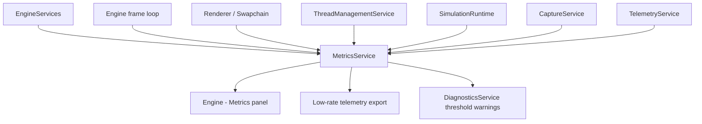

# Metrics And Profiling Service Design

**Status:** design proposal  
**Scope:** lightweight live metrics, frame statistics, scoped profiling, lock timing, render/simulation/job counters, and UI snapshots  
**Owner:** `EngineServices`  
**Intent:** make engine performance visible without turning hot paths into logging, allocation, or synchronization paths

## Purpose

`MetricsService` is the engine's lightweight numeric observation layer.

It answers:

- What is the current median frame rate?
- How expensive are frame, simulation, render, ImGui, capture, and telemetry stages?
- How many frames were acquired, submitted, presented, dropped, or skipped?
- How often do locks contend, and how long are they held?
- How much simulation math is being done per tick?
- What are background jobs doing, and where are they waiting?
- Which service is getting more expensive over time?

Metrics are not diagnostics, events, or logs.

```text
Metrics     = compact numeric live statistics and profiling windows.
Telemetry   = durable sampled data streams and exported run records.
Diagnostics = correctness/trust issues.
Events      = compact discrete happenings.
Logging     = narrative text.
```

The service should be cheap enough to leave enabled in normal debug builds, and
selectively compiled or configured for release builds.

## C++ Engineering Standard

Implementation should follow modern C++ best practices as expressed in the C++
Core Guidelines and related industry guidance. The project targets modern C++
in the C++20/C++23 style: prefer clear ownership, RAII, value semantics where
appropriate, strong project scalar aliases, and narrow dependencies.
Use project standard types such as `byte`, `f32`, `f64`, `i32`, `u32`, and `u64`
where they express project-owned domain data. It is acceptable to use native
boundary types such as `int`, `std::size_t`, `char`, `std::string`, or external
enum/integer types where the STL, ImGui, GLFW, Vulkan, filesystem APIs, or
another library API expects them.

Prefer the standard vocabulary types available in modern C++20/C++23 when they
make intent explicit: `std::optional` for meaningful absence, `std::expected`
for recoverable fallible operations, and `std::variant` for closed sets of
known runtime categories. These should be favored over sentinel values, loosely
structured status codes, output-parameter error channels, or `dynamic_cast`
where a type-safe result or sum type expresses the contract clearly.

Use the Rule of Zero for ordinary value/config/model types. Use the Rule of
Three or Rule of Five where a type manages ownership, lifetime, polymorphism, or
non-trivial copy/move behavior. Abstract interfaces should make slicing
impossible while still allowing derived types to use appropriate copy/move
semantics.

After major changes and before check-ins, run the normal build/tests and the
clang-tidy build. The tidy build is the guardrail for guideline issues such as
special member function policy:

```powershell
cmake -S . -B cmake-build-tidy -G Ninja -DCMAKE_BUILD_TYPE=Tidy
cmake --build cmake-build-tidy --target nurbs_dde
```

## Opinionated Direction

Build this as a small aggregation service first, not as a full tracing system.

The useful first version is:

- fixed-size rolling windows
- counters
- gauges
- min/max/mean/median/p95 summaries
- scoped timers
- thread/job statistics
- a restrained ImGui panel
- optional handoff into `TelemetryService` at low frequency

Avoid:

- strings or paths on hot-path metric submission
- per-sample heap allocation
- dynamically creating metric names during a frame
- logging every timing sample
- global locks around every metric write
- treating this as a replacement for Tracy, PIX, RenderDoc, ETW, or GPU vendor tools

The service should expose "how is the engine behaving right now?" and support
longer-term export through telemetry when needed.

## Architectural Position



`MetricsService` should be owned by `EngineServices` and accessed through
`SimulationHost` / `EngineAPI` only where simulations need to report explicit
domain work counts.

The implementation should live under:

```text
src/engine/metricservice
```

## Dependency Policy

Allowed core dependencies:

- standard library atomics and chrono types
- project scalar and ID types
- fixed-size arrays/rings
- `ThreadRole`, `ThreadJobId`, `ComponentId`, `RuntimeNodeId`, `ResourceId`

Avoid in the core service:

- ImGui
- Vulkan objects
- GLFW objects
- filesystem paths
- simulation concrete types
- formatting-heavy string work

UI formatting belongs in the metrics panel. Durable run export belongs in
`TelemetryService`.

## Metric Identity

Metric writers should use compact IDs, not text names.

All metric identity should be compile-time constant. Do not support runtime
metric registration in the core service. This keeps metric descriptors stable,
cheap to validate, and easy to use from hot paths.

```cpp
enum class MetricId : u32 {
    FrameMs,
    FrameFps,
    FrameAcquireMs,
    FrameSubmitMs,
    FramePresentMs,
    ImGuiBuildMs,
    SimulationTickMs,
    SimulationRenderSubmitMs,
    TelemetryTickMs,
    EventDrainMs,
    LoggerDrainMs,
    CaptureReadbackMs,
    BackgroundJobWaitMs,
    BackgroundJobRunMs,
    RuntimeLockWaitNs,
    RuntimeLockHoldNs,
};
```

Human-readable names, units, display grouping, and colors should live in a
compile-time descriptor table:

```cpp
struct MetricDescriptor {
    MetricId id;
    ComponentId component;
    MetricKind kind;
    MetricUnit unit;
    std::string_view name;
    std::string_view group;
};

inline constexpr std::array metric_descriptors = {
    MetricDescriptor{
        .id = MetricId::FrameMs,
        .component = ComponentId{"engine.frame"},
        .kind = MetricKind::Duration,
        .unit = MetricUnit::Milliseconds,
        .name = "Frame",
        .group = "Frame",
    },
};
```

Metric IDs and descriptors are part of the engine contract. They should be
stable enough for tests, panels, diagnostics thresholds, and telemetry export.

## Core Types

```cpp
enum class MetricKind : u8 {
    Counter,
    Gauge,
    RollingSample,
    Duration,
    Rate,
};

enum class MetricUnit : u8 {
    Count,
    Frames,
    Ticks,
    Jobs,
    Bytes,
    Milliseconds,
    Nanoseconds,
    PerSecond,
    Percent,
};

struct MetricSummary {
    u64 count = u64(0);
    f64 latest = 0.0;
    f64 min = 0.0;
    f64 max = 0.0;
    f64 mean = 0.0;
    f64 median = 0.0;
    f64 p95 = 0.0;
};

struct MetricSnapshot {
    MetricId id;
    MetricSummary short_window;
    MetricSummary long_window;
};

struct LockWorkMetrics {
    u64 acquisitions = u64(0);
    u64 contentions = u64(0);
    u64 total_wait_ns = u64(0);
    u64 total_hold_ns = u64(0);
};
```

Use project scalar aliases for project-owned values. STL boundary APIs can keep
`std::size_t` where container indexing requires it.

## Rolling Windows

For frame-rate and stage timing, prefer fixed-size rolling windows:

```text
short window = 120 samples   // about two seconds at 60 FPS
long window  = 600 samples   // about ten seconds at 60 FPS
```

Median FPS should be computed from frame time, not by taking the median of
instantaneous FPS samples.

Recommended display:

```text
median_frame_ms = median(frame_ms_window)
median_fps      = median_frame_ms > 0 ? 1000 / median_frame_ms : 0
```

This avoids a noisy FPS readout and makes spikes obvious in p95 frame time.

## Frame Metrics

Record these from `Engine::run_frame()` and the renderer frame boundaries:

| Metric | Source | Notes |
|---|---|---|
| frame index | engine | monotonically increasing `u64` |
| frame ms | engine | wall-clock frame delta |
| median FPS | derived | from median frame ms |
| ImGui build ms | main thread | widget construction and `ImGui::Render()` |
| render task wait ms | main thread | time waiting for renderer-role task, if threaded |
| simulation render submit ms | main thread / simulation runtime | CPU packet preparation, render-service submission, geometry cache rebuilds, and render snapshot handoff |
| swapchain acquire ms | renderer | `vkAcquireNextImageKHR` region |
| command record ms | renderer | Vulkan command recording |
| queue submit ms | renderer | submission call region |
| present ms | renderer | present call region |
| frames submitted | renderer | counter |
| frames presented | renderer | counter |
| frames skipped | engine/renderer | counter with compact reason enum |
| draw calls | renderer | current existing renderer counter |

These should be available in an `Engine - Metrics` panel before any durable
export is added.

Interpretation rule:

```text
High frame ms + low Vulkan acquire/submit/present ms = CPU-side frame work.
High Simulation Render Submit ms = render packet preparation/cache rebuilds,
not GPU queue submission.
```

`SimulationRenderSubmitMs` is intentionally broader than Vulkan submission. In
the current engine it includes calls such as `ISimulation::on_submit_render()`
and simulation packet emission into `RenderService`. A high value here usually
means CPU geometry work, packet copies, cache invalidation, hover/picking
geometry, or alternate-view packet construction.

## Simulation And Math Metrics

Simulation metrics should distinguish time from amount of work.

Recommended counters:

- ticks advanced
- ticks skipped while paused
- simulation tick ms
- render submit ms
- telemetry tick ms
- particles updated
- agents updated
- field samples
- surface evaluations
- derivative evaluations
- metric factor evaluations
- curvature evaluations
- random samples generated
- integrator steps
- rejected/adaptive substeps, when added

The "amount of math" should be explicit counters, not inferred from time.

```cpp
struct SimulationWorkMetrics {
    u64 particles_updated = u64(0);
    u64 field_samples = u64(0);
    u64 surface_evaluations = u64(0);
    u64 derivative_evaluations = u64(0);
    u64 metric_evaluations = u64(0);
    u64 curvature_evaluations = u64(0);
    u64 integrator_steps = u64(0);
};
```

The active simulation should publish compact work packets periodically. Avoid
calling a shared metric API for every particle or every derivative in the hot
loop. Prefer local accumulation into a thread-owned `SimulationWorkMetrics`
struct, then copy the accumulated values into the service during the periodic
metrics drain.

Render packet preparation should be treated separately from simulation-state
advance. With `simulation.threaded_runtime = true`, the simulation tick can run
on the simulation thread, while packet preparation may still occur on the
main/render-submit path if it mutates main-owned services such as
`RenderService`, `InteractionService`, or camera/view state.

Optimization targets when `SimulationRenderSubmitMs` is high:

- avoid marking surface mesh caches dirty every tick unless topology, grid,
  surface definition, or field structure actually changed
- separate persistent geometry caches from per-frame transform/submission
  packets
- move expensive geometry/cache generation to a worker or simulation-owned
  staging object, then publish immutable snapshots/resources
- keep hover/picking helper geometry conditional and bounded
- avoid rebuilding alternate-view contour/vector/flow packets unless their
  inputs changed

## Background Job Metrics

`ThreadManagementService` should be the primary source for job metrics.

Track:

- jobs submitted
- jobs rejected because queue is full
- jobs cancelled
- jobs completed
- jobs failed
- queue depth
- wait time from submission to start
- run time from start to completion
- callback/drain time on owner thread
- job owner role
- job priority

Useful derived stats:

- median wait ms
- p95 wait ms
- median run ms
- p95 run ms
- queue saturation percent
- oldest queued job age

Use `ThreadJobId` and compact enums for owner/priority/state. Job labels may be
descriptors or debug-only strings stored by the thread service, not pushed into
the metric sample path.

## Lock Metrics

Lock profiling is valuable, but it can become self-inflicted overhead quickly.

Recommended approach:

- provide an opt-in profiled lock wrapper for important engine locks
- collect wait time and hold time
- aggregate by compact `LockId`
- compile or config gate detailed lock timing
- sample if overhead becomes visible

```cpp
enum class LockId : u32 {
    SimulationRuntime,
    LoggerService,
    ThreadManagementService,
    EventMailbox,
    ResourceManagerService,
    CaptureService,
};
```

Suggested API shape:

```cpp
class ProfiledLockGuard {
public:
    ProfiledLockGuard(MetricsService& metrics, LockId id, std::mutex& mutex);
    ~ProfiledLockGuard();

    ProfiledLockGuard(const ProfiledLockGuard&) = delete;
    ProfiledLockGuard& operator=(const ProfiledLockGuard&) = delete;
};
```

Do not instrument every `std::scoped_lock` immediately. Start with:

- `SimulationRuntime::m_mutex`
- `ThreadManagementService::m_mutex`
- `LoggerService::m_mutex`
- event mailbox mutex

These are the locks most likely to explain frame stalls as threading advances.

## API Sketch

```cpp
class MetricsService {
public:
    void begin_frame(u64 frame_index, f64 wall_time_seconds);
    void end_frame();

    void increment(MetricId id, u64 amount = u64(1)) noexcept;
    void set_gauge(MetricId id, f64 value) noexcept;
    void record_sample(MetricId id, f64 value) noexcept;
    void record_duration(MetricId id, std::chrono::nanoseconds duration) noexcept;

    void record_simulation_work(const SimulationWorkMetrics& work) noexcept;
    void record_job_submitted(ThreadJobId id, ThreadRole owner, ThreadJobPriority priority) noexcept;
    void record_job_started(ThreadJobId id) noexcept;
    void record_job_finished(ThreadJobId id, ThreadJobStatus status) noexcept;

    [[nodiscard]] std::vector<MetricSnapshot> snapshot() const;
    void reset() noexcept;
};
```

For scoped regions:

```cpp
class ScopedMetricTimer {
public:
    ScopedMetricTimer(MetricsService& metrics, MetricId id) noexcept;
    ~ScopedMetricTimer();

    ScopedMetricTimer(const ScopedMetricTimer&) = delete;
    ScopedMetricTimer& operator=(const ScopedMetricTimer&) = delete;
};
```

This is a Rule-of-Five/RAII type because it records on destruction.

## Instrumentation Policies

Stats should stay orthogonal to reusable mechanics. Prefer small
instrumentation policies for low-level reusable types instead of scattering
direct `MetricsService` calls throughout the codebase.

Recommended pattern:

```cpp
struct NoStatsPolicy {
    void increment(MetricId, u64 = u64(1)) noexcept {}
    void duration(MetricId, std::chrono::nanoseconds) noexcept {}
};

struct ThreadLocalStatsPolicy {
    void increment(MetricId id, u64 amount = u64(1)) noexcept {
        if (MetricsThreadContext* ctx = MetricsThreadHandle::current()) {
            ctx->increment(id, amount);
        }
    }

    void duration(MetricId id, std::chrono::nanoseconds value) noexcept {
        if (MetricsThreadContext* ctx = MetricsThreadHandle::current()) {
            ctx->record_duration(id, value);
        }
    }
};
```

Reusable hot-path structures can accept a stats policy:

```cpp
template <class StatsPolicy = NoStatsPolicy>
class EventRing {
public:
    void push(events::EventRecord record) {
        // normal ring logic
        m_stats.increment(MetricId::EventsPublished);
    }

private:
    [[no_unique_address]] StatsPolicy m_stats;
};
```

Use policy-based instrumentation for reusable mechanics:

- fixed rings and queues
- event rings
- worker/job queues
- lock wrappers
- allocator or arena counters
- simulation work accumulators
- renderer frame counters when the abstraction is local and tidy

Prefer explicit scoped timers or direct service calls for top-level
orchestration:

- `Engine::run_frame()`
- panel/UI code
- one-off service lifecycle methods
- places where an explicit timing region is clearer than a template parameter

The rule of thumb is:

```text
Template policies for reusable mechanics.
Explicit metrics for orchestration.
```

This keeps stats isolated without turning broad engine code into a templated
maze.

## Threading Model

The first implementation should use periodic aggregation from thread-safe
producer state into the main metrics store.

Every producer owns a small metrics staging area. The producer accumulates
counters, durations, and work totals locally. On a periodic drain, the main
thread copies those staging values into `MetricsService`, then aggregates them
into fixed-size rings and summary tables.

Managed engine threads should also expose a lightweight metrics context. The
context can be backed by `thread_local` staging storage so hot-path metrics do
not contend on the central service. `ThreadManagementService` can install the
context when it starts a worker, simulation, render, or logger thread, and
clear it when the thread exits.

```cpp
class MetricsThreadContext {
public:
    void increment(MetricId id, u64 amount = u64(1)) noexcept;
    void record_duration(MetricId id, std::chrono::nanoseconds duration) noexcept;
    void record_lock_wait(LockId id, std::chrono::nanoseconds duration) noexcept;
    void record_lock_hold(LockId id, std::chrono::nanoseconds duration) noexcept;
    void accumulate_simulation_work(const SimulationWorkMetrics& work) noexcept;
};
```

The public service can provide a small handle for thread code:

```cpp
class MetricsThreadHandle {
public:
    [[nodiscard]] MetricsThreadContext* current() const noexcept;
};
```

This keeps producer code from reaching into the service owner state. It also
makes lock profiling cheap: a profiled lock records wait/hold durations into
the current thread's local staging area, and the metrics drain later copies the
batched lock samples into percentile windows.

The thread-local accumulators should be plain data structures. Prefer
standard-layout, trivially copyable fields where practical: counters,
durations, fixed arrays, compact enums, and small POD-like aggregate structs.
They should not own heap allocations, strings, file paths, service handles, or
callbacks. This is what makes periodic collection cheap: the drain can copy a
small block of per-thread data, clear the producer-facing counters, and perform
the heavier aggregation after leaving the producer's hot path.

This shape also leaves room for optimized copies. A future implementation may
copy aligned accumulator blocks with compiler-generated vector moves or
platform intrinsics, but correctness should not depend on SIMD.

Pros:

- simple snapshots for ImGui
- no global metric lock on hot paths
- aligns with existing service-drain architecture
- easy to test
- supports one-frame or multi-frame aggregation intervals

Cons:

- metrics are one frame delayed
- producers need per-role staging buffers

Recommended producer patterns:

- **Thread-local staging:** best default for managed engine threads. Workers,
  simulation, render, and logger threads accumulate metrics locally and expose
  those staging buffers to the periodic service drain.
- **Atomic counters:** best for simple monotonic counts such as frames
  submitted, jobs completed, dropped samples, and math operation totals. Drain
  with `exchange(0)` when the value represents "work since last drain."
- **Double-buffered staging:** best for batches of related values. Producers
  write to one buffer while the metrics drain copies and clears the other.
- **Short locked staging struct:** acceptable for low-frequency producers such
  as job lifecycle updates, provided the lock is local to that producer and
  never wraps user work.
- **SPSC ring:** useful when ordered timing samples matter, such as lock
  wait/hold samples from one thread into the main aggregation drain.
- **Sequence-numbered snapshot:** useful when a producer can copy a small POD
  struct without blocking. The producer increments a sequence before and after
  writing; the drain accepts only stable even-sequence snapshots.

For most engine metrics, a thread-owned staging struct plus periodic copy is
the right default. The ring buffer belongs in the aggregation side, where
percentile windows are maintained.

Example shape:

```cpp
struct ThreadMetricsStaging {
    ThreadRole role = ThreadRole::Unknown;
    std::atomic<u64> frames_submitted = u64(0);
    std::atomic<u64> jobs_completed = u64(0);
    std::atomic<u64> dropped_samples = u64(0);

    LockWorkMetrics lock_work;
    SimulationWorkMetrics simulation_work;
};
```

Use atomics for counters, not for percentile windows. Windows should be drained
and aggregated in one owner context.

Recommended drain cadence:

- every frame for frame/render metrics
- every N simulation ticks for math-work counters when simulation is threaded
- every 250-1000 ms for background job summary export
- immediately on shutdown so final counters are not lost

The drain should copy-and-clear producer state quickly, then do heavier
summary/percentile work after producer locks have been released.

## CPU And GPU Timing

CPU-side timing is the first milestone. It should cover engine frame stages,
simulation ticks, render submission handoff, job wait/run time, and optional
lock timing.

GPU timestamp queries are a later milestone after the render-thread split has
been smoke-tested. When added, GPU timings should be their own metric group and
should not replace CPU-side frame-stage timing.

## Storage Policy

Use fixed-size rings for windows and bounded maps/tables for descriptors.

Recommended defaults:

```text
registered metrics: 128
short window:       120 samples per rolling metric
long window:        600 samples per rolling metric
job records:        256 recent jobs
lock records:       32 lock IDs
```

`registered metrics` is the compile-time descriptor capacity, not a dynamic
registration limit.

Avoid unbounded growth. If a metric sample is dropped, increment a compact
`dropped_metric_samples` counter.

## Statistics

Median and p95 do not require fancy online algorithms at this scale.

For windows of 120 and 600 samples:

- copy the active values into a small scratch buffer
- use `std::nth_element` for median
- use `std::nth_element` for p95
- compute mean by summing

This is simple, deterministic, and cheap enough for once-per-frame UI
snapshots.

If this later grows to thousands of streams or very large windows, consider
histograms or streaming quantile sketches. Do not start there.

## SIMD Policy

Do not vendor a SIMD library for the first milestone.

Most early work is control-flow heavy rather than arithmetic heavy: copying
small staging structs, clearing counters, updating rings, and computing
median/p95 over small windows. Modern compilers are already good at generating
efficient moves for trivially copyable aligned data, and `std::nth_element`
over 120-600 samples will not be the bottleneck compared with rendering,
simulation, and synchronization costs.

SIMD may become useful later for:

- copying or clearing large aligned accumulator arrays
- reducing large numeric windows
- histogram accumulation
- batch formatting-independent summary calculations
- GPU/CPU timing post-processing across many streams

If a SIMD abstraction is needed later, prefer one of these routes in order:

1. Standard C++ facilities if available in the active toolchain.
2. A tiny internal wrapper around the few platform intrinsics actually used.
3. A vendored SIMD library only after profiling shows the metrics service itself
   is a measurable bottleneck.

The first implementation should instead make SIMD unnecessary by keeping
accumulators compact, fixed-size, aligned where useful, and cheap to copy.

## UI Panel

Add an `Engine - Metrics` panel after the service has snapshots.

Keep it dense:

- top row: median FPS, p95 frame ms, latest frame ms, dropped samples
- tabs or collapsing groups: Frame, Render, Simulation, Jobs, Locks
- small tables, not large cards
- color only for thresholds
- no historical graph until the core summaries are stable

Useful first table:

| Metric | Latest | Median | P95 | Max |
|---|---:|---:|---:|---:|
| Frame | 16.7 ms | 16.6 ms | 18.2 ms | 31.0 ms |
| Simulation tick | 2.1 ms | 1.8 ms | 4.0 ms | 8.4 ms |
| Render submit | 1.2 ms | 1.1 ms | 2.2 ms | 4.7 ms |
| Job wait | 0.4 ms | 0.2 ms | 3.9 ms | 12.0 ms |

## Telemetry Export

`MetricsService` should not be the durable history store.

Instead, export selected summaries to `TelemetryService` at low frequency:

```text
metrics.frame.median_fps
metrics.frame.p95_ms
metrics.simulation.tick_median_ms
metrics.render.submit_median_ms
metrics.jobs.wait_p95_ms
metrics.locks.runtime_wait_p95_ns
```

Export once per second or once every N frames. Do not emit telemetry for every
metric sample by default.

## Diagnostics Integration

Metrics can produce diagnostics when thresholds remain bad for a sustained
window:

- p95 frame time above budget for 5 seconds
- job queue saturated for 2 seconds
- lock wait p95 above a configured threshold
- metric samples dropped
- renderer submitted frames but presented none

These should be warnings about engine health, not spammy per-frame messages.

## Configuration

Suggested config section:

```json
{
  "metrics": {
    "enabled": true,
    "lock_profiling": false,
    "job_profiling": true,
    "telemetry_export": true,
    "short_window_samples": 120,
    "long_window_samples": 600,
    "thread_drain_interval_frames": 1,
    "job_export_interval_ms": 500,
    "ui_panel_enabled": true
  }
}
```

Lock profiling should default off until measured overhead is known.

## Implementation Plan

1. Add `MetricsTypes.hpp` with IDs, descriptors, summaries, job/lock snapshot
   types, and `SimulationWorkMetrics`.
2. Add `MetricsService.hpp/.cpp` under `src/engine/metricservice`.
3. Add engine ownership through `EngineServices`.
4. Record frame ms and median FPS from `Engine::run_frame()`.
5. Add scoped timers around simulation tick, render submit/present task,
   ImGui build, event drain, logger drain, and telemetry tick.
6. Add `MetricsThreadContext` / `MetricsThreadHandle` for thread-local
   accumulation.
7. Add periodic thread metrics staging and drain support.
8. Add job submitted/started/finished handoff from `ThreadManagementService`.
9. Add optional lock profiling wrapper for the highest-value locks.
10. Add `Engine - Metrics` panel with dense tables.
11. Export selected summaries to `TelemetryService` at low frequency.
12. Add tests for rolling-window median/p95, bounded storage, job timing, and
    dropped-sample accounting.

## Test Plan

Focused unit tests:

- rolling window computes median from odd and even counts
- p95 is stable for partially filled windows
- counter increment accumulates without allocation
- gauge latest value replaces previous value
- bounded ring drops old samples or counts dropped samples according to policy
- median FPS derives from median frame ms
- job wait/run stats handle submitted, started, finished ordering
- cancelled/rejected jobs update counters
- snapshots are stable while producers are inactive
- reset clears windows but preserves registered descriptors

Threading tests:

- worker staging drains on main thread
- render-role staging drains on main thread
- managed threads install and clear a metrics thread context
- atomic count drains use exchange-and-clear semantics
- double-buffered staging does not block producer work during aggregation
- dropped samples increment when staging/ring capacity is exceeded
- lock profiling can be compiled/config disabled

## Decisions

- The service is named `MetricsService`.
- The implementation lives under `src/engine/metricservice`.
- Metric IDs and descriptors are compile-time constants. No runtime metric
  registration belongs in the core service.
- CPU-side timing comes first. GPU timestamp queries are a later milestone.
- Threaded producers accumulate metrics in safe local staging state. The
  service periodically copies those values into aggregation rings and summary
  tables.
- Managed engine threads should use thread-local metrics contexts installed by
  `ThreadManagementService`.
- Per-agent and per-operation math work should be accumulated locally and
  published as compact batched counters, not emitted as individual hot-loop
  metric samples.

## First Milestone

The smallest valuable version:

- `MetricsService` owned by `EngineServices`
- rolling `frame_ms` window
- median FPS, p95 frame ms, max frame ms
- counters for frames submitted/presented/skipped
- background job submitted/started/finished counters
- median/p95 job wait and run time
- dense `Engine - Metrics` panel
- unit tests for windows and job stats

That gives immediate value without disturbing event, logger, telemetry, or
threading contracts.
