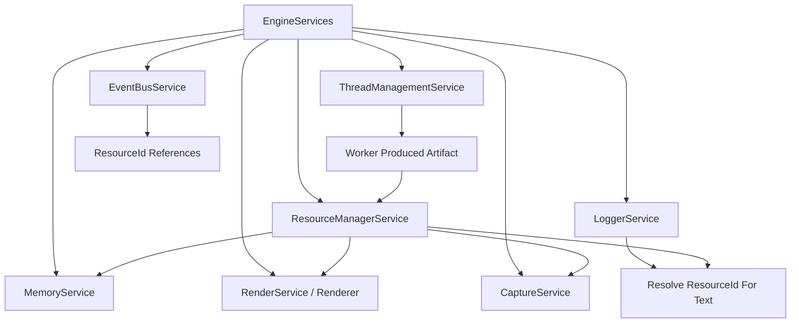

# ResourceManagerService Design

**Status:** design contract  
**Scope:** resource identity, cross-thread ownership transfer, artifact lookup, lifetime tracking, and service-visible handles  
**Owner:** `EngineServices`  
**Intent:** let fully threaded systems pass large generated artifacts by ID while continuing to use the project's existing arenas and buffer managers for storage

## Purpose

`ResourceManagerService` owns addressable runtime artifacts.

It answers:

- What is resource `902`?
- What stable handle names a built-in or loaded resource?
- Which service owns it?
- Which thread may mutate or adopt it?
- Which memory scope or GPU owner stores it?
- Is it still alive?
- Was it registered at compile time, runtime, or loaded from a path?
- Can a render/simulation/logger/capture job safely consume it?
- What metadata describes it for logs, events, diagnostics, and UI panels?

This service is not a replacement for `MemoryService`, `BufferManager`, PMR
arenas, or Vulkan resource wrappers. It is the identity and ownership layer
above them.

```text
MemoryService          = lifetime-scoped CPU/GPU allocation.
BufferManager          = per-frame GPU-visible linear vertex arena.
ResourceManagerService = addressable artifacts, ownership transfer, lookup.
ThreadManagementService = threads/jobs that produce or consume resource IDs.
EventBusService        = compact events that reference resources by ID.
LoggerService          = human text that can resolve resource IDs for display.
CaptureService         = visual artifacts and capture-specific naming policy.
```

## C++ Engineering Standard

Implementation should follow modern C++ best practices as expressed in the C++
Core Guidelines and related industry guidance. The project targets modern C++
in the C++20/C++23 style: prefer clear ownership, RAII, value semantics where
appropriate, strong project scalar aliases, and narrow dependencies.
Use project standard types such as `byte`, `f32`, `f64`, `i32`, `u32`, and `u64`
where they express project-owned domain data. It is acceptable to use native
boundary types such as `int`, `std::size_t`, `std::thread::id`, file-system
types, Vulkan handles, or external enum/integer types where the STL, ImGui,
GLFW, Vulkan, filesystem APIs, or another library API expects them.

Prefer the standard vocabulary types available in modern C++20/C++23 when they
make intent explicit: `std::optional` for meaningful absence, `std::expected`
for recoverable fallible operations, and `std::variant` for closed sets of
known runtime categories. These should be favored over sentinel values, loosely
structured status codes, output-parameter error channels, or `dynamic_cast`
where a type-safe result or sum type expresses the contract clearly.

Use the Rule of Zero for ordinary value/config/model types. Use the Rule of
Three or Rule of Five where a type manages ownership, lifetime, polymorphism, or
non-trivial copy/move behavior. Abstract interfaces should make slicing
impossible while still allowing derived types to use appropriate copy/move
semantics.

After major changes and before check-ins, run the normal build/tests and the
clang-tidy build. The tidy build is the guardrail for guideline issues such as
special member function policy:

```powershell
cmake -S . -B cmake-build-tidy -G Ninja -DCMAKE_BUILD_TYPE=Tidy
cmake --build cmake-build-tidy --target nurbs_dde
```

## Why MemoryService Is Still Sufficient For Storage

The existing memory system is the right storage foundation:

- `memory.frame()` for per-frame scratch and render packet payloads
- `memory.view()` for view-owned state
- `memory.simulation()` for active simulation objects/state
- `memory.cache()` for reusable derived geometry/cache data
- `memory.history()` for trails, DDE history, replay/export history
- `memory.persistent()` for app/service/session lifetime data
- `BufferManager` for per-frame host-visible GPU vertex arena slices

`ResourceManagerService` does not replace these. It answers a different
question.

```text
MemoryService asks: "Where does this storage live, and when is it reset?"
ResourceManager asks: "What is this artifact, who owns it, and how can another
thread/service refer to it without a pointer or large payload copy?"
```

When a worker generates a large mesh, image, file artifact, or upload request,
the bytes should still live in a `MemoryService` scope or renderer/capture owner
appropriate to the lifetime. The worker result should carry a `ResourceId` so
the owning thread can adopt the artifact without passing raw pointers through
events or logs.

## Resource Examples

Resources are addressable artifacts, not arbitrary allocations.

Good resource examples:

- generated CPU mesh cache
- immutable render snapshot payload
- GPU upload request
- texture/image data
- font files and cached font bytes
- built-in shader, colormap, mesh, material, or scenario asset
- capture PNG artifact
- capture frame-sequence manifest
- imported file
- telemetry CSV artifact
- solver lookup table
- worker-produced geometry build result

Poor resource examples:

- a single particle position
- a short event label
- per-frame temporary vertices that are consumed immediately
- arbitrary raw allocation with no service boundary
- text that belongs to `LoggerService`
- individual glyph cache records derived from a font atlas

## Font Resource Boundary

Font files are first-class resources because they cross service boundaries:

```text
assets/fonts/*.ttf or *.otf
  -> ResourceManagerService path registration
  -> ResourceManagerService load()
  -> FontResource{ResourceId, ResourceHandle, path, byte_count, bytes}
  -> TextOverlayService active font handle/id
  -> renderer TextRenderer FreeType face + glyph atlas cache
```

The manager owns font identity, file path metadata, load diagnostics, and cached
font bytes. It does not own renderer-specific glyph caches.

Derived glyph and atlas data belongs to the text renderer:

- FreeType face/size state
- glyph advances, bearings, bitmap extents, and atlas UVs
- GPU atlas images, samplers, descriptors, and text draw batches

Those derived records should be keyed by the font `ResourceId`/`ResourceHandle`,
font role, pixel size, and atlas generation. They should not be exposed as
hundreds of public `ResourceId` entries unless a future cross-service use case
requires it.

## Ownership

`ResourceManagerService` is owned by the engine through `EngineServices`.

```cpp
class EngineServices {
public:
    ResourceManagerService& resources() noexcept;
};
```

The service should be added before full threading because it gives worker,
simulation, render, logger, telemetry, and capture systems a common ID-based
handoff vocabulary.

Initial code location:

```text
src/engine/resources/
    ResourceManagerService.hpp
    ResourceManagerService.cpp
    ResourceTypes.hpp
```

## Architectural Position



## Non-Goals

`ResourceManagerService` must not:

- replace `MemoryService` scopes or PMR allocation policy
- become a generic heap allocator
- own per-frame scratch that does not cross a service/thread boundary
- allow arbitrary raw pointers to cross threads
- hide Vulkan ownership rules
- store event text or log strings
- become a telemetry sample store
- make every small object a resource

## Core Types

`ResourceId` already lives in `RuntimeIds.hpp` because events, logs,
diagnostics, capture, and future thread results need a shared compact ID type.
It identifies a concrete resource instance known to the manager.

```cpp
struct ResourceId {
    u64 value = u64(0);

    friend constexpr bool operator==(ResourceId, ResourceId) noexcept = default;
};
```

The public API should prefer handles over raw IDs when a caller needs a stable
reference to a known resource. A handle can be registered at compile time for
built-ins, or allocated at runtime for imported/generated resources.

```cpp
struct ResourceHandle {
    u64 value = u64(0);

    friend constexpr bool operator==(ResourceHandle, ResourceHandle) noexcept = default;
};

struct ResourceGeneration {
    u64 value = u64(0);

    friend constexpr bool operator==(ResourceGeneration, ResourceGeneration) noexcept = default;
};
```

Recommended distinction:

```text
ResourceHandle = stable registry handle for "that thing".
ResourceId     = concrete loaded/published instance.
Generation     = stale-handle/stale-instance protection.
```

Example:

```text
handle: builtin.texture.colormap.viridis
id:     resource instance 118, loaded and ready
gen:    generation 3 after reload
```

Resource-specific type tags:

```cpp
enum class ResourceKind : u8 {
    Unknown,
    CpuMesh,
    RenderSnapshot,
    TextureImage,
    ShaderModule,
    Material,
    ColorMap,
    ScenarioAsset,
    GpuUpload,
    CaptureArtifact,
    FileArtifact,
    TelemetryArtifact,
    SolverCache,
    WorkerResult
};

enum class ResourceOrigin : u8 {
    Builtin,
    ConstexprRegistered,
    FilePath,
    Generated,
    Capture,
    External
};

enum class ResourceOwner : u8 {
    Engine,
    Simulation,
    Renderer,
    Capture,
    Telemetry,
    Logger,
    Worker,
    External
};

enum class ResourceLifetime : u8 {
    Frame,
    View,
    Simulation,
    Cache,
    History,
    Persistent,
    ExternalFile
};

enum class ResourceState : u8 {
    Reserved,
    Pending,
    Ready,
    Adopted,
    Released,
    Failed
};
```

Descriptor:

```cpp
struct ResourceDescriptor {
    ResourceId id = {};
    ResourceHandle handle = {};
    ResourceKind kind = ResourceKind::Unknown;
    ResourceOrigin origin = ResourceOrigin::Generated;
    ResourceOwner owner = ResourceOwner::Engine;
    ResourceLifetime lifetime = ResourceLifetime::Cache;
    ResourceState state = ResourceState::Reserved;
    ComponentId producer = ids::unknown_component;
    RuntimeNodeId source_node = {};
    u64 byte_count = u64(0);
    u64 generation = u64(0);
};
```

## Handle Registry

The manager should own a registry that maps stable handles and optional symbolic
keys to resource descriptors.

```cpp
struct ResourceKey {
    std::string_view value{};

    friend constexpr bool operator==(ResourceKey, ResourceKey) noexcept = default;
};

struct ResourceRegistration {
    ResourceHandle handle = {};
    ResourceKey key = {};
    ResourceKind kind = ResourceKind::Unknown;
    ResourceOrigin origin = ResourceOrigin::Generated;
    ResourceOwner owner = ResourceOwner::Engine;
    ResourceLifetime lifetime = ResourceLifetime::Persistent;
    ComponentId producer = ids::unknown_component;
};
```

For built-ins, handles should be constexpr where practical:

```cpp
namespace ndde::resource_handles {

inline constexpr ResourceHandle viridis_colormap{u64(0x0001'0000'0000'0001)};
inline constexpr ResourceHandle default_surface_material{u64(0x0001'0000'0000'0002)};
inline constexpr ResourceHandle line_shader{u64(0x0001'0000'0000'0003)};

} // namespace ndde::resource_handles
```

The exact numeric ranges should be reserved:

```text
0                         = invalid handle
0x0001_0000_0000_0000...  = constexpr built-ins
0x0002_0000_0000_0000...  = engine runtime registered
0x0003_0000_0000_0000...  = simulation/scenario registered
0x0004_0000_0000_0000...  = file/import generated
```

This gives compile-time references for known assets while still allowing loaded
resources to be registered dynamically.

The registry owns:

- handle -> descriptor index
- key -> handle lookup
- path -> handle/resource lookup for loaded files
- handle -> current `ResourceId`
- handle generation for stale-reference detection

## Handle Pool

Runtime handles should come from a pool. The pool should avoid reusing a handle
with the same generation while stale references may still exist.

```cpp
class ResourceHandlePool {
public:
    [[nodiscard]] ResourceHandle allocate(ResourceOwner owner,
                                          ResourceKind kind,
                                          ResourceOrigin origin);
    void release(ResourceHandle handle) noexcept;
    [[nodiscard]] bool valid(ResourceHandle handle) const noexcept;
    [[nodiscard]] ResourceGeneration generation(ResourceHandle handle) const noexcept;
};
```

First implementation can be simple:

- monotonic `u64` handle allocation
- no handle reuse during one app session
- generation stored for future stale checks

That is enough for correctness and debugging. A free-list pool can be added once
resource churn becomes real.

## Resource Payloads

Payloads should be closed and typed. Use `std::variant` rather than ad hoc
casting where practical.

```cpp
struct CpuMeshResource {
    ResourceId id = {};
    u64 vertex_count = u64(0);
    u64 index_count = u64(0);
    memory::MemoryLifetime storage = memory::MemoryLifetime::Cache;
};

struct RenderSnapshotResource {
    ResourceId id = {};
    u64 packet_count = u64(0);
    u64 vertex_count = u64(0);
};

struct FileArtifactResource {
    ResourceId id = {};
    std::filesystem::path path;
    u64 byte_count = u64(0);
};

struct PathBackedResource {
    ResourceId id = {};
    ResourceHandle handle = {};
    std::filesystem::path path;
    ResourceKind expected_kind = ResourceKind::Unknown;
    u64 byte_count = u64(0);
};

struct GpuUploadResource {
    ResourceId id = {};
    u64 byte_count = u64(0);
    ResourceState state = ResourceState::Pending;
};

using ResourcePayload = std::variant<
    CpuMeshResource,
    RenderSnapshotResource,
    FileArtifactResource,
    PathBackedResource,
    GpuUploadResource
>;
```

The payload describes or references the storage. The storage itself remains
owned by the appropriate memory scope, renderer, capture service, or external
file system.

## Public API

```cpp
class ResourceManagerService {
public:
    ResourceManagerService() = default;
    ~ResourceManagerService();

    ResourceManagerService(const ResourceManagerService&) = delete;
    ResourceManagerService& operator=(const ResourceManagerService&) = delete;
    ResourceManagerService(ResourceManagerService&&) = delete;
    ResourceManagerService& operator=(ResourceManagerService&&) = delete;

    void init(ResourceManagerConfig config);
    void shutdown() noexcept;

    [[nodiscard]] ResourceId reserve(ResourceKind kind,
                                     ResourceOwner owner,
                                     ResourceLifetime lifetime);

    [[nodiscard]] ResourceHandle register_handle(ResourceRegistration registration);
    [[nodiscard]] ResourceHandle register_builtin(ResourceRegistration registration);
    [[nodiscard]] ResourceHandle register_path(ResourceRegistration registration,
                                               std::filesystem::path path);

    [[nodiscard]] bool publish(ResourceId id, ResourcePayload payload);
    [[nodiscard]] std::expected<ResourceId, ResourceLoadError>
        load(ResourceHandle handle);
    [[nodiscard]] std::expected<ResourceId, ResourceLoadError>
        load_from_path(ResourceHandle handle, std::filesystem::path path);
    [[nodiscard]] bool mark_ready(ResourceId id);
    [[nodiscard]] bool mark_failed(ResourceId id, DiagnosticId diagnostic = {});
    [[nodiscard]] bool release(ResourceId id);

    [[nodiscard]] const ResourceDescriptor* descriptor(ResourceId id) const noexcept;
    [[nodiscard]] const ResourceDescriptor* descriptor(ResourceHandle handle) const noexcept;
    [[nodiscard]] const ResourcePayload* payload(ResourceId id) const noexcept;
    [[nodiscard]] std::optional<ResourceId> current(ResourceHandle handle) const noexcept;
    [[nodiscard]] std::optional<ResourceHandle> find(ResourceKey key) const noexcept;
    [[nodiscard]] std::optional<ResourceHandle> find_by_path(const std::filesystem::path& path) const;

    [[nodiscard]] std::vector<ResourceId> resources_by_owner(ResourceOwner owner) const;
    [[nodiscard]] std::vector<ResourceId> resources_by_kind(ResourceKind kind) const;
    [[nodiscard]] std::vector<ResourceId> resources_by_lifetime(ResourceLifetime lifetime) const;

    void sweep_released();
    void clear_lifetime(ResourceLifetime lifetime);
};
```

The first implementation can keep payloads simple and CPU-side. GPU-specific
resource adoption can remain renderer-owned until Vulkan lifetime rules are
fully explicit.

## MemoryService Integration

Use existing memory scopes for storage:

```text
Frame resource       -> memory.frame(), usually not ResourceManager unless it crosses threads.
View resource        -> memory.view().
Simulation resource  -> memory.simulation().
Cache resource       -> memory.cache().
History resource     -> memory.history().
Persistent resource  -> memory.persistent().
GPU frame vertices   -> BufferManager / ArenaSlice, render-thread owned.
```

Rules:

- If data does not cross a thread/service boundary, use `MemoryService` directly.
- If data crosses a thread/service boundary, register a `ResourceId`.
- If data is large, pass the ID, not the payload, through events/logs/results.
- If a memory scope is reset, matching resource descriptors must be invalidated
  or released.
- `ResourceManagerService` records the generation/lifetime so stale IDs can be
  detected.

## Threading Integration

The resource manager is a key support service for full threading.

Typical worker flow:

```text
worker job builds CPU mesh in cache/persistent storage
worker reserves ResourceHandle/ResourceId
worker publishes descriptor/payload
worker returns ResourceId in ThreadJobResult
simulation/render owner drains result
owner adopts resource or marks it released
```

Workers should not hand raw pointers to the render thread. They hand off
`ResourceId`. The adopting thread resolves the descriptor and validates owner,
state, generation, and kind before use.

Thread safety:

- `reserve()` may be MPSC-safe if workers reserve IDs directly.
- `publish()` may be MPSC-safe for worker-produced payload descriptors.
- payload storage must still obey its owning memory scope and thread contract.
- renderer-owned Vulkan handles are resolved/adopted on the render thread.

If implementing full MPSC safety immediately is too expensive, first route
worker resource registrations through `ThreadManagementService` result queues
and perform `publish()` on the owner thread.

## Path Loading

The resource manager should support path-backed loading without making file
paths event payloads.

Typical flow:

```text
startup registers handle "asset.texture.brush_noise" -> path assets/noise.png
caller asks ResourceManagerService::load(handle)
loader reads file on logger/I/O or worker thread
loader publishes ResourceId payload
events/logs/diagnostics refer to ResourceId or ResourceHandle
UI resolves path only through ResourceManagerService
```

Path-backed resources:

- are registered by handle/key first
- can be lazy-loaded
- can be reloaded by replacing the current `ResourceId` for the handle
- report failures through `DiagnosticsService`
- may cache byte count, timestamp, content hash, or format metadata

The path is metadata owned by `ResourceManagerService`, `CaptureService`, or a
future asset loader. It should not travel through `EventBusService` payloads.

## Constexpr Registration

Known engine resources should be referenced by constexpr handles so code can
depend on them without string lookup:

```cpp
namespace ndde::resource_handles {
inline constexpr ResourceHandle renderer_line_shader{u64(0x0001'0000'0000'0010)};
inline constexpr ResourceHandle renderer_triangle_shader{u64(0x0001'0000'0000'0011)};
inline constexpr ResourceHandle colormap_viridis{u64(0x0001'0000'0000'0020)};
}
```

Registration still happens at runtime startup:

```cpp
void register_builtin_resources(ResourceManagerService& resources)
{
    resources.register_builtin({
        .handle = resource_handles::colormap_viridis,
        .key = {"builtin.colormap.viridis"},
        .kind = ResourceKind::ColorMap,
        .origin = ResourceOrigin::ConstexprRegistered,
        .owner = ResourceOwner::Engine,
        .lifetime = ResourceLifetime::Persistent
    });
}
```

This mirrors the metadata pattern: constexpr IDs are stable references, while
runtime registration makes them discoverable and validates collisions.

## Event Integration

Events carry `ResourceId`, not paths, buffers, or resource text.

Examples:

```cpp
struct ResourceReadyEvent {
    ResourceId resource = {};
    ResourceKind kind = ResourceKind::Unknown;
    u64 byte_count = u64(0);
};

struct ResourceFailedEvent {
    ResourceId resource = {};
    DiagnosticId diagnostic = {};
};
```

`EventBusService` remains the route for compact happenings. Resource metadata
is read from `ResourceManagerService`.

## Logger Integration

`LoggerService` can format resource messages by resolving IDs:

```text
Resource 902 ready: CpuMesh, 18024 vertices
Capture artifact 2134 written to captures/run/main_000120.png
```

The logger stores the human text. The resource manager stores the resource
descriptor and payload metadata.

## Capture Integration

`CaptureService` currently owns capture naming and paths. That remains correct.
As threading grows, capture artifacts can also be registered with
`ResourceManagerService` so logs/events/thread results can refer to a shared
`ResourceId` while `CaptureService` remains the policy owner for capture naming.

`CaptureArtifactId` may remain capture-specific. It can either map directly to
`ResourceId` or be a capture-local ID that `CaptureService` resolves to a
resource later.

## Renderer Integration

The render thread owns Vulkan handles. Resource manager descriptors may refer
to render resources, but Vulkan lifetime stays behind renderer APIs.

Examples:

- worker produces CPU mesh resource
- render thread consumes resource and creates GPU buffer/texture
- renderer registers or updates a renderer-owned resource descriptor
- old GPU resource is released only after fences prove it is unused

Do not let worker threads destroy or mutate Vulkan objects.

## Diagnostics

Diagnostics should be emitted for:

- lookup of unknown `ResourceId`
- stale generation access
- wrong resource kind for consumer
- wrong owner thread adoption
- publish of an already released resource
- payload/lifetime mismatch
- memory scope reset while live resources remain
- resource leak at shutdown

These should flow through `DiagnosticsService` and the "Stuff Is Broken" panel,
not just log text.

## UI

Future Resource panel:

- resource ID
- kind
- owner
- lifetime
- state
- byte count
- producer component
- source node
- related diagnostics
- related log records

This panel is diagnostic tooling, not the hot path.

## Migration Plan

1. Add `ResourceManagerService` under `src/engine/resources`.
2. Add `resources()` to `EngineServices`.
3. Keep all storage in existing `MemoryService`/renderer/capture owners.
4. Add `ResourceHandle`, `ResourceHandlePool`, and descriptor-only
   registration.
5. Add constexpr built-in handle registration for shaders/materials/colormaps
   or other known resources.
6. Add path registration and lazy `load(handle)` support.
7. Add descriptor-only registration with `ResourceId` allocation.
8. Register capture artifacts as resources or map `CaptureArtifactId` to
   `ResourceId`.
9. Register worker-produced CPU mesh/cache results.
10. Add generation/lifetime validation against `MemoryService` scope resets.
11. Add logger/resource lookup helpers.
12. Add event descriptors for resource ready/failed/released.
13. Add renderer adoption path for CPU mesh/texture upload resources.

## Unit Test Targets

- service follows Rule of Five policy
- constexpr handles register and resolve
- duplicate handles and duplicate keys are rejected
- runtime handle pool returns nonzero handles
- released runtime handles are not unsafely reused with the same generation
- reserving resources returns stable nonzero IDs
- registering a path creates a handle without loading the payload
- loading a registered path publishes a ready resource or diagnostic failure
- duplicate publish is rejected
- lookup of unknown ID returns null/expected error
- resources query by owner/kind/lifetime
- release changes state and sweep removes released resources
- clear lifetime invalidates matching resources
- stale generation access is detected
- resource payload variant preserves type without casts
- capture/file artifact resource stores path metadata without putting paths on
  the event bus
- worker result can carry `ResourceId` only
- `ResourceHandle` can resolve to the current `ResourceId` after reload

## Open Decisions

- Should `CaptureArtifactId` become an alias/wrapper around `ResourceId`, or
  remain capture-local?
- Should resources be globally unique for the app lifetime or generation-scoped?
- Should the first implementation permit worker-thread `publish()`, or should
  all publish/adoption happen on owner-thread drains?
- Should GPU resources live in this service as opaque descriptors only, or
  should renderer expose a dedicated render resource registry?
- Should resource metadata be persisted for replay/capture manifests?
