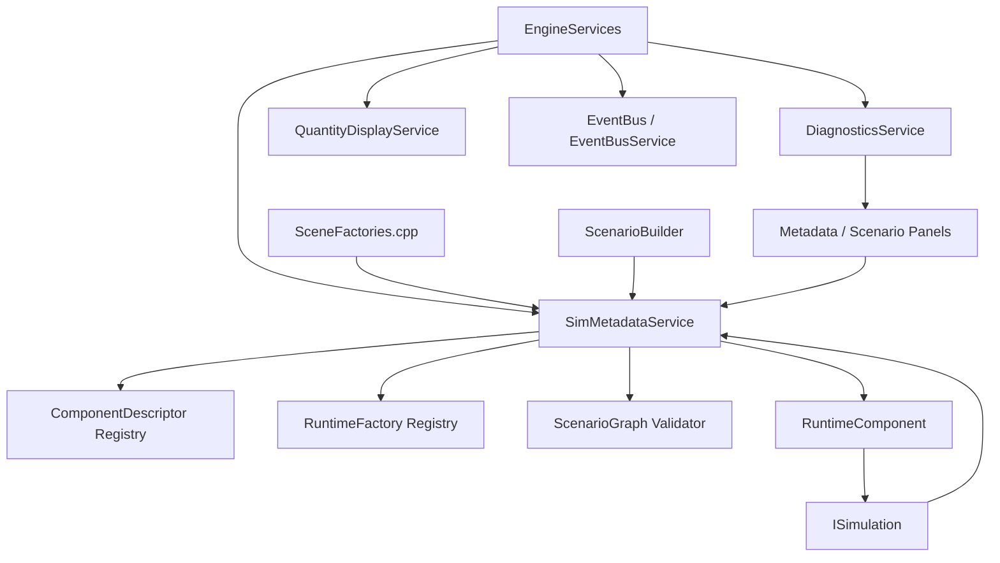

# SimMetadataService Design

**Status:** design contract  
**Scope:** metadata registry, component descriptors, scenario validation, and runtime factory lookup  
**Intent:** describe what can exist without owning the active mathematical state

## Purpose

`SimMetadataService` is the semantic registry for the mathematical laboratory.
It answers questions like:

- What surfaces, fields, controls, solvers, systems, and observables are known?
- What capabilities does a component provide?
- What assumptions does it require?
- What parameters can the UI edit?
- Can this component be constructed from a scenario file?
- Is a proposed scenario graph valid before runtime construction?

It does **not** own live simulation state. Active state remains owned by
`ISimulation` implementations and reusable math/simulation objects.

```text
SimMetadataService describes what can exist.
ISimulation owns what currently exists.
ScenarioBuilder constructs active objects.
DiagnosticsService reports validation and trust failures.
```

## C++ Engineering Standard

Implementation should follow modern C++ best practices as expressed in the C++
Core Guidelines and related industry guidance. The project targets modern C++
in the C++20/C++23 style: prefer clear ownership, RAII, value semantics where
appropriate, strong project scalar aliases, and narrow dependencies.
Use project standard types such as `byte`, `f32`, `f64`, `i32`, `u32`, and `u64`
where they express project-owned domain data. It is acceptable to use native
boundary types such as `int`, `std::size_t`, or external enum/integer types
where the STL, ImGui, GLFW, Vulkan, or another library API expects them.

Prefer the standard vocabulary types available in modern C++20/C++23 when they
make intent explicit: `std::optional` for meaningful absence, `std::expected`
for recoverable fallible operations, and `std::variant` for closed sets of
known runtime categories. These should be favored over sentinel values, loosely
structured status codes, output-parameter error channels, or `dynamic_cast`
where a type-safe result or sum type expresses the contract clearly.

Use the Rule of Zero for ordinary value/config/model types. Use the Rule of
Three or Rule of Five where a type manages ownership, lifetime, polymorphism, or
non-trivial copy/move behavior. Abstract interfaces should make slicing
impossible while still allowing derived types to use appropriate copy/move
semantics.

After major changes and before check-ins, run the normal build/tests and the
clang-tidy build. The tidy build is the guardrail for guideline issues such as
special member function policy:

```powershell
cmake -S . -B cmake-build-tidy -G Ninja -DCMAKE_BUILD_TYPE=Tidy
cmake --build cmake-build-tidy --target nurbs_dde
```

## Architectural Position



## Non-Goals

`SimMetadataService` must not:

- replace `ISimulation`
- store active particles, fields, surfaces, or solver state
- submit render packets
- open ImGui panels directly
- dispatch high-frequency telemetry
- own Vulkan resources
- silently coerce invalid units or parameters

## Core Concepts

### Component

A component is a registered mathematical or runtime-capable type. Examples:

- `Torus`
- `MetricRipple`
- `DampingField`
- `BrownianBehavior`
- `SeekParticleBehavior`
- `SimplePendulumSystem`
- `PlanarNBodyGravitySystem`
- `Rk4OdeSolver`
- `SimulationWavePredatorPrey`

### Descriptor

A descriptor is stable metadata about a component: category, capabilities,
assumptions, parameters, ports, trust, docs, and factory availability.

### Runtime Component

A runtime component is an object created from a descriptor and config. It may be
a surface, field, control law, solver, ODE system, or future NURBS object.

### Scenario Graph

A scenario graph is a declarative description of nodes and edges before active
objects are constructed. It is validated against registered descriptors.

## Root Categories

```cpp
enum class ObjectCategory {
    GeometricObject,
    FieldObject,
    OperatorObject,
    DynamicalObject,
    ControlObject,
    ObservableObject
};
```

Category meanings:

- `GeometricObject`: surfaces, manifolds, charts, NURBS curves, spline paths
- `FieldObject`: metric ripples, damping fields, potential fields, diffusion fields
- `OperatorObject`: derivative, Jacobian, Hessian, Laplace-Beltrami, solvers
- `DynamicalObject`: ODE, DDE, SDE, particle system, N-body gravity
- `ControlObject`: pursue, avoid, orbit, Markov controller, policy
- `ObservableObject`: telemetry streams, diagnostics, curvature probes

## Stable IDs

```cpp
struct ComponentId {
    std::string value;
};

struct RuntimeNodeId {
    u64 value = 0;
};

struct StreamId {
    std::string value;
};

struct EventTypeId {
    std::string value;
};
```

Rules:

- `ComponentId` is stable across sessions and scenario files.
- `RuntimeNodeId` is unique inside one running scenario graph.
- IDs compare by value.
- Component IDs should be namespace-like:
  - `surface.torus`
  - `field.metric_ripple`
  - `behavior.seek`
  - `solver.ode.rk4`
  - `system.gravity.planar_n_body`

## Capabilities

```cpp
enum class Capability {
    ParameterDomain,
    EmbeddedEvaluation,
    MetricTensor,
    InverseMetricTensor,
    ChristoffelSymbols,
    TangentBundle,
    CotangentBundle,
    ExponentialMap,
    LogarithmMap,
    GeodesicDistance,
    GaussianCurvature,
    MeanCurvature,
    Orientable,
    Compact,
    NoBoundary,

    DriftContribution,
    DiffusionContribution,
    MetricContribution,
    SurfaceDisplacementContribution,

    ODESystem,
    DDESystem,
    DDEHistory,
    RandomStream,
    StochasticTransition,

    ControlLaw,
    CompositeControlLaw,
    StateController,
    MarkovControlLaw,

    BezierCurve,
    BSplineCurve,
    NURBSCurve,
    ArcLengthParameterization,
    GeodesicSpline,

    DerivativeOperator,
    JacobianOperator,
    HessianOperator,
    LaplaceBeltramiOperator,

    TelemetryProducer,
    RenderPacketProducer,
    ReplaySerializable
};
```

Capabilities describe what a component can provide. Required capabilities
describe what another component needs from its inputs.

Example: a metric-aware Brownian controller may require:

```text
InverseMetricTensor
RandomStream
```

## Assumptions

```cpp
enum class Assumption {
    C0Continuity,
    C1Continuity,
    C2Regularity,
    SmoothEnoughForCurvature,
    PositiveDefiniteMetric,
    ChartDomainValid,
    NoCutLocusCrossing,
    OrientedDomain,
    CompactDomain,
    IrreducibleMarkovChain,
    GeneratorRowsSumToZero,
    NonnegativeOffDiagonalRates,
    KnotVectorNondecreasing,
    NURBSWeightsPositive,
    ReplaySeedAvailable
};
```

Assumptions are promises made by a component or validation rules that must be
checked before a component is trusted.

## Descriptor API

```cpp
struct DocumentationRef {
    std::string title;
    std::string path;
    std::string section;
};

enum class TrustLevel {
    Experimental,
    Tested,
    Validated,
    Research
};

struct TrustMetadata {
    TrustLevel level = TrustLevel::Experimental;
    std::string summary;
    std::vector<std::string> test_names;
    std::vector<std::string> known_limitations;
};

struct ComponentDescriptor {
    ComponentId id;
    std::string display_name;
    ObjectCategory category;

    std::vector<Capability> capabilities;
    std::vector<Capability> required_capabilities;
    std::vector<Assumption> assumptions;

    std::vector<ParameterSchema> parameters;
    std::vector<PortDescriptor> input_ports;
    std::vector<PortDescriptor> output_ports;

    TrustMetadata trust;
    DocumentationRef docs;

    bool factory_available = false;
};
```

## Parameter Schema

```cpp
enum class ParameterType {
    Bool,
    Int,
    Float,
    Vec2,
    Vec3,
    Matrix,
    String,
    Enum,
    Quantity,
    ComponentRef,
    JsonObject
};

enum class QuantityKind {
    Dimensionless,
    Time,
    Frequency,
    Length,
    Angle,
    Area,
    Curvature,
    Speed,
    Acceleration,
    Probability,
    TransitionRate,
    DwellTime,
    NURBSWeight,
    ParameterT,
    MetricFactor,
    Energy
};

enum class Mutability {
    Live,
    RequiresRecompute,
    RequiresComponentRebuild,
    RequiresScenarioRestart
};

struct ParameterDomain {
    std::optional<f64> min;
    std::optional<f64> max;
    bool inclusive_min = true;
    bool inclusive_max = true;
};

enum class UiHint {
    Checkbox,
    Slider,
    Drag,
    Input,
    Combo,
    Color,
    FilePath,
    MultilineText
};

struct ParameterSchema {
    std::string key;
    std::string display_name;
    ParameterType type;
    QuantityKind quantity_kind = QuantityKind::Dimensionless;
    Mutability mutability = Mutability::Live;
    std::optional<ParameterDomain> domain;
    std::optional<UiHint> ui_hint;
    std::string description;
};
```

## Ports

Ports describe graph compatibility.

```cpp
enum class PortKind {
    Geometry,
    Field,
    Control,
    State,
    Telemetry,
    RenderPacket,
    Event,
    Quantity
};

struct PortDescriptor {
    std::string name;
    PortKind kind;
    std::string type_name;
    bool required = false;
};
```

Example:

```text
MetricRipple
  input:  surface_point : State
  output: metric_factor : Field
  output: displacement  : Field
```

## Runtime Factory API

Factories construct runtime components from validated config.

```cpp
class RuntimeComponent {
public:
    virtual ~RuntimeComponent() = default;

    virtual ComponentId component_id() const = 0;
    virtual std::string_view display_name() const = 0;
};

using RuntimeFactory =
    std::function<MathResult<std::unique_ptr<RuntimeComponent>>(const Json& config)>;
```

Adapters can wrap existing concrete types:

```cpp
template<class T>
class RuntimeComponentAdapter final : public RuntimeComponent {
public:
    RuntimeComponentAdapter(ComponentId id, std::string display_name, T value);

    ComponentId component_id() const override;
    std::string_view display_name() const override;

    T& get();
    const T& get() const;
};
```

This allows incremental migration without changing every existing type at once.

## Service API

```cpp
class SimMetadataService {
public:
    bool register_component(ComponentDescriptor descriptor);
    bool register_factory(ComponentId id, RuntimeFactory factory);

    const ComponentDescriptor* get_descriptor(ComponentId id) const;

    std::vector<const ComponentDescriptor*>
    query_category(ObjectCategory category) const;

    std::vector<const ComponentDescriptor*>
    query_capability(Capability capability) const;

    std::vector<const ComponentDescriptor*>
    query_required_capability(Capability capability) const;

    ValidationReport validate_component_config(ComponentId id, const Json& config) const;
    ValidationReport validate_scenario(const ScenarioGraph& graph) const;

    MathResult<std::unique_ptr<RuntimeComponent>>
    create(ComponentId id, const Json& config) const;

    std::span<const ComponentDescriptor> descriptors() const;
};
```

## Messages And Reports

`SimMetadataService` does not directly own diagnostics UI. It returns reports
and can forward them to `DiagnosticsService`.

```cpp
enum class DiagnosticSeverity {
    Info,
    Warning,
    Error,
    Fatal
};

enum class ErrorCode {
    DuplicateComponentId,
    MissingDescriptor,
    MissingFactory,
    MissingCapability,
    InvalidParameter,
    UnitMismatch,
    ChartOutOfDomain,
    SolverDiverged,
    SingularMatrix,
    KnotVectorInvalid,
    ContinuityViolation,
    MarkovTransitionInvalid,
    GeneratorRowsDoNotSumToZero,
    NegativeTransitionRate,
    ReplaySeedMissing
};

struct ValidationIssue {
    DiagnosticSeverity severity;
    ErrorCode code;
    std::string message;
    std::string suggested_fix;
    std::optional<ComponentId> component;
    std::optional<RuntimeNodeId> node;
};

struct ValidationReport {
    std::vector<ValidationIssue> issues;

    bool ok() const;
    bool has_errors() const;
    bool has_warnings() const;
};
```

Recommended event messages:

```cpp
struct ComponentRegisteredEvent {
    ComponentId id = ids::unknown_component;
    ObjectCategory category = ObjectCategory::GeometricObject;
};

struct ComponentFactoryRegisteredEvent {
    ComponentId id = ids::unknown_component;
};

struct ScenarioValidationEvent {
    RuntimeNodeId scenario = {};
    u64 warning_count = u64(0);
    u64 error_count = u64(0);
};
```

These are discrete events. They carry IDs and compact counts, not scenario names
or full reports. The full validation report remains owned by diagnostics or
metadata APIs, and sampled values belong to telemetry.

## Scenario Graph

```cpp
struct ScenarioNode {
    RuntimeNodeId node_id;
    ComponentId component;
    Json config;
};

struct ScenarioEdge {
    RuntimeNodeId from;
    std::string from_port;
    RuntimeNodeId to;
    std::string to_port;
};

struct ScenarioGraph {
    std::string name;
    std::vector<ScenarioNode> nodes;
    std::vector<ScenarioEdge> edges;
};
```

Validation checks:

- every node references a known component
- required parameters exist
- parameter types match schema
- quantity kinds and units are compatible
- required input ports are connected
- connected ports have compatible kinds/types
- required capabilities are satisfied by connected providers
- assumptions are either validated or surfaced as warnings
- factories exist for nodes that must be constructed

## Consumers

### EngineServices

Owns the service:

```cpp
class EngineServices {
public:
    SimMetadataService& metadata() noexcept;
};
```

### SceneFactories

Registers built-in component descriptors at startup:

```text
surface.wave_predator_prey
surface.torus
field.metric_ripple
field.damping
behavior.seek
behavior.avoid
behavior.brownian
solver.ode.euler
solver.ode.rk4
system.gravity.pendulum
system.gravity.planar_n_body
simulation.wave_predator_prey
```

### ScenarioBuilder

Uses metadata to:

- validate agent specs
- validate fields
- validate Markov controllers
- validate NURBS specs
- create runtime components when scenario config references a component ID

### Panels

Metadata panels consume descriptors to show:

- known components
- categories
- capabilities
- assumptions
- parameter schemas
- docs links
- factory availability
- validation status

Panels must not become the only place where validation or construction logic
lives.

### DiagnosticsService

Consumes validation reports and displays active issues.

### QuantityDisplayService

Consumes `ParameterSchema` and `QuantityKind` to parse, format, and convert
parameter values.

### Telemetry

Telemetry can use descriptors to discover streams, but metadata is not the
sample store. Stream registration should live in the evolved telemetry service.

### Events

`SimMetadataService` also owns `EventDescriptor` registration. Event descriptors
make event types discoverable to panels, scenario tooling, diagnostics, logger
formatters, and documentation links without requiring event payloads to carry
human strings.

```cpp
struct EventDescriptor {
    EventTypeId id;
    std::string display_name;
    EventScope scope = EventScope::Simulation;
    DiagnosticSeverity default_severity = DiagnosticSeverity::Info;
    ComponentId producer = ids::unknown_component;
    DocumentationRef docs;
};
```

Publishing is not currently gated on descriptor registration. The registry is
the lookup/discovery layer; gating can be added later once all canonical events
are registered.

## Example Descriptors

### Metric Ripple

```cpp
ComponentDescriptor metric_ripple{
    .id = {"field.metric_ripple"},
    .display_name = "Metric Ripple",
    .category = ObjectCategory::FieldObject,
    .capabilities = {
        Capability::MetricContribution,
        Capability::SurfaceDisplacementContribution,
        Capability::DiffusionContribution
    },
    .required_capabilities = {
        Capability::ParameterDomain
    },
    .assumptions = {
        Assumption::PositiveDefiniteMetric,
        Assumption::SmoothEnoughForCurvature
    },
    .parameters = {
        {"amplitude", "Amplitude", ParameterType::Quantity,
         QuantityKind::MetricFactor, Mutability::Live},
        {"beta", "Temporal Decay", ParameterType::Quantity,
         QuantityKind::Frequency, Mutability::Live}
    },
    .trust = {
        .level = TrustLevel::Tested,
        .summary = "Conformal ripple contributes metric factor and displacement."
    },
    .factory_available = true
};
```

### Planar N-Body Gravity

```cpp
ComponentDescriptor n_body{
    .id = {"system.gravity.planar_n_body"},
    .display_name = "Planar N-Body Gravity",
    .category = ObjectCategory::DynamicalObject,
    .capabilities = {
        Capability::ODESystem,
        Capability::TelemetryProducer
    },
    .parameters = {
        {"gravitational_constant", "Gravitational Constant",
         ParameterType::Quantity, QuantityKind::Dimensionless,
         Mutability::RequiresRecompute},
        {"softening", "Softening",
         ParameterType::Quantity, QuantityKind::Length,
         Mutability::Live},
        {"masses", "Masses",
         ParameterType::JsonObject, QuantityKind::Dimensionless,
         Mutability::RequiresComponentRebuild}
    },
    .trust = {
        .level = TrustLevel::Tested,
        .test_names = {
            "GravitationalSystems.TwoBodyCircularOrbitReturnsNearStart"
        }
    },
    .factory_available = true
};
```

## Registration Flow

Initial registration should be boring and explicit:

```cpp
void register_builtin_metadata(SimMetadataService& metadata)
{
    metadata.register_component(make_torus_descriptor());
    metadata.register_component(make_metric_ripple_descriptor());
    metadata.register_component(make_seek_behavior_descriptor());
    metadata.register_component(make_rk4_solver_descriptor());
    metadata.register_component(make_planar_n_body_descriptor());

    metadata.register_factory({"field.metric_ripple"}, make_metric_ripple_factory());
    metadata.register_factory({"system.gravity.planar_n_body"}, make_planar_n_body_factory());

    metadata.register_event({
        .id = {"event.sim.agent_captured"},
        .display_name = "Agent Captured",
        .scope = EventScope::Simulation,
        .producer = ids::simulation_wave_predator_prey,
        .docs = {"EventBusService", "docs/EVENT_BUS_SERVICE.md", "Simulation Events"}
    });
}
```

Later, registration can move into modules/plugins, but startup registration
should stay deterministic.

## Storage And Performance

The registry is small. Prefer clarity:

- `std::vector<ComponentDescriptor>` for stable iteration
- `std::unordered_map<std::string, u64>` or an equivalent index type for lookup
- factories stored separately by `ComponentId`

Descriptors are long-lived and read-mostly after startup. Threading can be
added later with a shared mutex if dynamic plugin loading needs it.

## Migration Plan

### Phase 1: Empty Service And Built-In Descriptors

- Add `SimMetadataService`
- Add descriptor types
- Add registration for existing surfaces, fields, behaviors, solvers, and active simulation
- Add tests for duplicate IDs and category/capability queries

### Phase 2: Validation

- Add `ScenarioGraph`
- Add parameter validation
- Add capability/port validation
- Route `ValidationReport` into `DiagnosticsService`

### Phase 3: Factories

- Add `RuntimeComponent`
- Add adapter wrappers for existing concrete objects
- Add factories for simple systems:
  - `MetricRipple`
  - `DampingField`
  - `SimplePendulumSystem`
  - `PlanarNBodyGravitySystem`

### Phase 4: Panels

- Add Metadata Registry panel
- Add descriptor detail view
- Add scenario validation summary

### Phase 5: ScenarioBuilder Integration

- Allow scenario JSON/config to reference component IDs
- Keep current hand-built scenario paths working
- Use metadata validation before object construction

## Acceptance Tests

Required early tests:

- registering a component makes it queryable by ID
- duplicate component ID is rejected or reported
- category query returns expected descriptors
- capability query returns expected descriptors
- missing required parameter creates a validation issue
- wrong quantity kind creates a validation issue
- factory absence is reported for constructible nodes
- factory creation returns a runtime component for a valid config

Required integration tests:

- built-in metadata registration includes current active simulation
- `MetricRipple` descriptor advertises metric and displacement contribution
- `PlanarNBodyGravitySystem` descriptor advertises ODE capability
- Metadata panel can read descriptors without constructing runtime objects

## Open Design Questions

- Should descriptors be stored as pure C++ structs only, or also serialized to
  JSON for documentation and tooling?
- Should `ComponentId` be interned for faster comparisons?
- Should factories return typed adapters or a variant of known runtime object
  categories?
- Should validation warnings be cached per scenario graph hash?
- Should component docs link to local markdown, generated API docs, or both?

## First Implementation Target

The first implementation should be intentionally small:

```text
SimMetadataService exists.
Current built-in components register descriptors.
Descriptors are queryable by category and capability.
No existing simulation behavior changes.
Tests prove registry and duplicate-ID behavior.
```

That gives the rest of the upgrade plan a stable semantic spine without
disrupting the working app.
