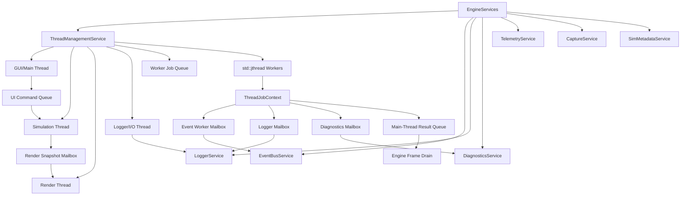

# ThreadManagementService Design

**Status:** implementation in progress; worker/logger/simulation/render-presentation foundation implemented
**Scope:** full application threading, worker lifecycle, render/UI separation, job submission, shutdown, mailboxes, and cross-thread service boundaries  
**Owner:** `EngineServices`  
**Intent:** move the app toward a fully threaded runtime while keeping ownership explicit, cancellable, observable, and unable to corrupt simulation/UI/renderer state

## Purpose

`ThreadManagementService` owns the engine's background execution model.

It answers:

- Which threads exist?
- Which service owns their lifetime?
- Which thread owns UI, simulation, rendering, logging, telemetry, and workers?
- How is work submitted?
- How is work cancelled?
- How do workers report progress, failures, logs, and events?
- Which APIs are main-thread only?
- How does shutdown wait for outstanding work without deadlocks?

The service is not the event bus, logger, diagnostics service, telemetry store,
or renderer. It coordinates background execution and routes cross-thread
communication through bounded service-owned mailboxes.

```text
ThreadManagementService = app thread lifecycle and job execution.
EventBusService         = compact discrete happenings and worker event mailbox.
LoggerService           = human-readable log records and string storage.
DiagnosticsService      = correctness/trust issues and active broken-state records.
TelemetryService        = sampled numeric/state measurements.
Renderer/Platform       = main/render-thread Vulkan, GLFW, and ImGui ownership.
```

The first implemented milestone is not merely "some background workers": it is
the engine-owned execution substrate that future simulation/render/logger
threads will depend on. The current implementation includes:

- `ThreadManagementService` under `src/engine/threading`
- engine ownership through `EngineServices`
- access through `SimulationHost`
- bounded worker queue using `std::jthread`
- cancellable jobs using `std::stop_source` / `std::stop_token`
- job status tracking and completed result drain
- worker-to-owner mailboxes for logs, diagnostics, and compact event records
- channel-aware compact event mailbox for worker and simulation-thread event
  records
- logger-thread drain for worker log messages
- logger-thread task queue for bounded I/O work such as telemetry flush/close
- logger snapshots for UI reads while the logger thread is active
- simulation-thread command queue for future UI/main-to-simulation handoff
- dedicated simulation loop thread with start/stop lifecycle and command-batch callback
- `SimulationRuntime::process_thread_commands()` adapter for thread-driven runtime ticks
- `ISimulation` update/render split through `on_simulation_tick()` and `on_submit_render()`
- `SimulationRuntime::tick_simulation()` state-only path for simulation-thread execution
- runtime serialization between simulation ticks and render submission
- runtime serialization between simulation ticks and telemetry hooks
- surface-poke simulation command payload for main/UI-owned input handoff
- optional engine live wiring via `simulation.threaded_runtime`
- latest simulation render snapshot mailbox with deep-copied immutable data
- render-thread command queue and immutable `RenderFrameSnapshot` handoff type
- renderer-thread task queue for synchronous renderer-role work such as
  swapchain frame recording, submission, and presentation
- optional engine live wiring via `render.threaded_presentation`
- main-thread role tracking and deterministic shutdown
- thread-role guard API for main/render/simulation/logger/worker ownership checks
- Main-owned `EventBusService` typed publish/subscribe/reset/drain APIs
  guarded by the thread-role service; cross-thread events use compact
  mailboxes
- `LoggerService` direct string-store writes guarded to the Logger thread;
  Main/worker/simulation code use mailboxes or logger tasks
- `TelemetryService` extension scratch is Main-owned, while flush/stop-close
  can be handed to the Logger/I/O thread; primary telemetry remains a
  single-producer ring contract
- `CaptureService` manifest writes are handed to the Logger/I/O task lane when
  thread services are available, with direct fallback for tests/tools
- `RenderService` mutation APIs guarded by the thread-role service during the
  current Main-owned transition
- GUI/Main-owned `PanelService`, `HotkeyService`, and `InteractionService`
  mutation APIs guarded by the thread-role service
- Main-owned `CameraService` mutation APIs guarded by the thread-role service
- Main-owned `DiagnosticsService` ingestion APIs guarded by the thread-role
  service; workers must report diagnostics through thread mailboxes
- Main-owned `SimMetadataService` registry mutation APIs and
  `ViewInputService` pointer-state mutation APIs guarded by the thread-role
  service
- Main-owned `ResourceManagerService` registry mutation APIs and
  `CaptureService` capture-queue/movie-state APIs guarded by the thread-role
  service
- focused unit tests and tidy build coverage

The target is not merely "some background workers." The target is a fully
threaded application:

```text
GUI/Main thread       = GLFW polling, ImGui command construction, UI service drains.
Simulation thread    = simulation tick, scenario state, math state mutation.
Render thread        = Vulkan command recording/submission/presentation.
Logger/I/O thread    = log file sinks, telemetry flush, capture manifests.
Worker pool          = bounded large jobs such as cache builds and validation.
```

This should happen sooner rather than later. The app is still small enough that
thread ownership can be introduced cleanly before accidental shared-state
patterns harden into the architecture.

Examples of work that belongs here:

- offline capture conversion launcher state, if added later
- expensive geometry/cache generation
- scenario validation batches
- metadata indexing
- telemetry flush jobs
- file import/export jobs
- future solver jobs that can run outside the main simulation tick

Examples of work that does not belong here:

- direct ImGui calls
- direct GLFW calls
- direct Vulkan swapchain/presentation calls from non-render threads
- mutating active simulation state from a worker
- publishing typed simulation events directly from arbitrary worker threads

## C++ Engineering Standard

Implementation should follow modern C++ best practices as expressed in the C++
Core Guidelines and related industry guidance. The project targets modern C++
in the C++20/C++23 style: prefer clear ownership, RAII, value semantics where
appropriate, strong project scalar aliases, and narrow dependencies.
Use project standard types such as `byte`, `f32`, `f64`, `i32`, `u32`, and `u64`
where they express project-owned domain data. It is acceptable to use native
boundary types such as `int`, `std::size_t`, `std::thread::id`, or external
enum/integer types where the STL, ImGui, GLFW, Vulkan, filesystem APIs, or
another library API expects them.

Prefer the standard vocabulary types available in modern C++20/C++23 when they
make intent explicit: `std::optional` for meaningful absence, `std::expected`
for recoverable fallible operations, and `std::variant` for closed sets of
known runtime categories. These should be favored over sentinel values, loosely
structured status codes, output-parameter error channels, or `dynamic_cast`
where a type-safe result or sum type expresses the contract clearly.

Use the Rule of Zero for ordinary value/config/model types. Use the Rule of
Three or Rule of Five where a type manages ownership, lifetime, polymorphism, or
non-trivial copy/move behavior. Abstract interfaces should make slicing
impossible while still allowing derived types to use appropriate copy/move
semantics.

After major changes and before check-ins, run the normal build/tests and the
clang-tidy build. The tidy build is the guardrail for guideline issues such as
special member function policy:

```powershell
cmake -S . -B cmake-build-tidy -G Ninja -DCMAKE_BUILD_TYPE=Tidy
cmake --build cmake-build-tidy --target nurbs_dde
```

## Ownership

`ThreadManagementService` is owned by the engine through `EngineServices`.

```cpp
class EngineServices {
public:
    ThreadManagementService& threads() noexcept;
};
```

The engine owns this service because engine shutdown must stop workers before
destroying services, windows, Vulkan objects, simulation state, and memory
arenas that workers might otherwise reference.

When full threading is enabled, `Engine` becomes the orchestrator rather than
the place where every subsystem executes inline. It starts the GUI/main loop,
owns service lifecycle, and coordinates shutdown. The simulation, render,
logger/I/O, and worker executors are owned through `ThreadManagementService`.

Initial code location:

```text
src/engine/threading/
    ThreadManagementService.hpp
    ThreadManagementService.cpp
    ThreadTypes.hpp
```

## Architectural Position



## Non-Goals

`ThreadManagementService` must not:

- own mathematical simulation state
- own renderer/Vulkan resources
- call ImGui, GLFW, or swapchain APIs from workers
- allow multiple threads to mutate one service without an explicit mailbox or
  synchronization contract
- publish typed simulation events directly from workers
- store unbounded strings, paths, image frames, or telemetry rows
- hide failures in worker-local logs
- detach threads that outlive engine shutdown
- make shutdown depend on arbitrary sleeps

## Thread Roles

```cpp
enum class ThreadRole : u8 {
    Main,
    Gui,
    Simulation,
    Renderer,
    Logger,
    Worker,
    Io,
    Telemetry,
    Unknown
};
```

Current runtime is mostly single-threaded:

- GLFW, ImGui, and current Vulkan presentation run on the main thread.
- Simulation ticks run on the main thread.
- Event log drain runs on the main thread.
- Telemetry push paths are designed for one producer and one consumer.
- Compact worker and simulation-thread event mailboxes exist. The live runtime
  can queue simulation ticks and surface-poke commands, then drain compact event
  records back into `EventBusService` on the owner thread.

Target split:

```text
GUI/Main thread
Simulation thread
Renderer thread
Logger/I/O thread
Worker pool
```

This split is a near-term architectural goal. It should be phased, but the
thread ownership rules should be documented and enforced before large new
systems assume a single-threaded engine.

## Thread Ownership Matrix

| System | Owning Thread | Other Threads May |
|---|---|---|
| GLFW window/events | GUI/Main | enqueue commands only |
| ImGui frame/build | GUI/Main | enqueue UI model updates only |
| Vulkan renderer/swapchain | Render | submit immutable render frame commands only |
| Active simulation state | Simulation | enqueue commands/jobs only |
| `EventBusService` typed channels | Main during transition | use compact event mailboxes only |
| `LoggerService` string store | Logger | enqueue log records/mailbox messages |
| `DiagnosticsService` active issues | Main/Diagnostics drain | enqueue diagnostic reports |
| `TelemetryService` lifecycle/ext/flush | Main for lifecycle/ext, Logger for flush/close | primary SPSC record producer only |
| Worker pool | Worker threads | use constrained `ThreadJobContext` |

No row should silently become "everyone can mutate it." If a second thread needs
access, add an explicit command queue, mailbox, immutable snapshot, or owned
resource transfer.

APIs with a strict owner should call
`ThreadManagementService::require_thread_role(expected, api_name)` at their
boundary. A violation returns `false` and emits a `ThreadRoleViolation`
diagnostic so the "Stuff Is Broken" panel can surface the misuse. This is a
runtime guardrail during migration; once ownership is fully separated, hot-path
checks can be compiled out or replaced with narrower debug assertions.

During the transition, `RenderService` is wired as Main-owned because Vulkan,
GLFW, ImGui, and render-packet submission are still co-threaded in the engine
frame. When render submission/presentation moves to a dedicated render thread,
the service owner role should change to `ThreadRole::Renderer` and callers
should submit immutable render snapshots or render commands instead of mutating
the packet queues directly.

`PanelService`, `HotkeyService`, and `InteractionService` are also wired as
Main-owned. Worker and simulation threads should communicate with them through
commands, snapshots, or input handoff records rather than direct mutation.
`CameraService` is Main-owned during this phase because camera motion mutates
render-view camera descriptors directly.
`DiagnosticsService` active issue state is Main-owned during this phase.
Workers and simulation callbacks should report through `ThreadJobContext` or
`ThreadManagementService` mailboxes so diagnostics are ingested on the owning
thread.
`SimMetadataService` registry mutation is Main-owned; workers may read stable
metadata only through future immutable snapshots or owner-approved APIs.
`ViewInputService` is Main-owned because it reflects GLFW/ImGui frame input.
`ResourceManagerService` registry mutation is Main-owned during this phase;
workers should return resource IDs/results through job completion and let the
owner publish or register them. `CaptureService` is Main-owned because capture
requests are tied to window/render state and artifact queues.
`EventBusService` typed publish/subscribe/reset/drain APIs are Main-owned
during this phase. Worker and simulation threads publish compact `EventRecord`
values through mailboxes, then the owner drains them into fixed-size event logs.
`LoggerService` accepts direct writes only from the Logger thread once
`EngineServices` wires the owner guard. Other threads must use
`ThreadJobContext::log()` or the thread-service logger mailbox so string
ownership stays centralized.
`TelemetryService` lifecycle and extension-record scratch storage are
Main-owned. Primary telemetry records still use the existing single-producer
ring contract.
The writer handoff is now explicit for periodic flush and sim/app stop-close:
the engine queues telemetry flush/close work onto the logger task queue, and
`TelemetryService` permits those operations from `ThreadRole::Logger`.
Extension-record scratch storage remains guarded separately so the logger
thread never races an extension producer.

The render split now has a service-level boundary: GUI/Main can enqueue
`RenderThreadCommand` values containing immutable `RenderFrameSnapshot` data,
and a render thread callback consumes them under `ThreadRole::Renderer`.
Vulkan/ImGui are still live-migrated in later renderer work, but the ownership
path no longer needs to be invented at the same time as the Vulkan move.

## Locking Policy

The threading model uses three synchronization styles:

- owner-thread guards for services that should not be touched from arbitrary
  threads
- short `std::mutex` / `std::scoped_lock` regions for shared service state and
  mailbox swaps
- fixed-size SPSC-style ring buffers for telemetry and compact event records

Do not add broad locks to hide unclear ownership. If a service has one logical
owner, guard its mutating APIs with `require_thread_role()` and route
cross-thread work through commands, mailboxes, immutable snapshots, or resource
handles. Use locks only where shared ownership is intentional and documented.

Current locks:

- `ThreadManagementService`: `std::mutex` plus condition variables for worker,
  logger, simulation-command, event, diagnostic, and result mailboxes.
- `SimulationRuntime`: `std::recursive_mutex` around simulation lifecycle,
  tick, render-submit, telemetry-hook, metadata, and snapshot publication.
- `LoggerService`: `std::mutex` around string/record storage.
- `EventBusService`: `std::mutex` around channel mailboxes; the compact event
  rings remain fixed-size ring buffers.
- `TelemetryService`: primary records use the telemetry ring; extension
  records and flush scratch are owner-thread state.
- `SimulationSnapshotStore`: `std::mutex` around latest snapshot publication.

Current owner-guarded services:

- Main-owned: `PanelService`, `HotkeyService`, `InteractionService`,
  `RenderService`, `CameraService`, `DiagnosticsService`,
  `EventBusService`, `SimMetadataService`, `ViewInputService`,
  `ResourceManagerService`, `CaptureService`, and `TelemetryService`
  lifecycle/flush/extension-record paths.
- Simulation-owned: active simulation state through `SimulationRuntime`.
- Logger-owned or mailbox-driven: `LoggerService` writes.
- Renderer-owned command lane: `RenderThreadCommand` / `RenderFrameSnapshot`
  handoff through `ThreadManagementService`.

## Frame Pipeline

The intended steady-state loop is:

```text
GUI/Main:
  poll GLFW
  build ImGui commands and panels from snapshots
  enqueue simulation commands
  drain diagnostics/events/logger snapshots for display

Simulation:
  consume simulation commands
  advance SimulationRuntime tick
  publish compact events/telemetry
  produce immutable SimulationRenderSnapshot

Render:
  consume latest SimulationRenderSnapshot
  build/record Vulkan command buffers
  render scene and UI draw data
  present swapchain image

Logger/I/O:
  drain log mailbox
  flush telemetry/capture/log files
  publish compact completion/failure records

Worker Pool:
  execute bounded jobs
  publish compact worker records
  enqueue typed results/resources for owner-thread adoption
```

The first version can run GUI and render on the same OS thread if GLFW/ImGui
constraints make that simpler, but the service contract should still isolate
"UI command construction" from "render submission" so they can split later.

## Cross-Thread Data Patterns

Use one of these patterns for every cross-thread handoff:

- `CommandQueue<T>`: ordered commands from one owner to another.
- `LatestValueMailbox<T>`: latest snapshot wins; stale render/simulation
  snapshots may be dropped.
- `SpscRing<T>`: one producer, one consumer, fixed-size high-rate stream.
- `MpscMailbox<T>`: many workers report compact results to one owner.
- `ResourceId` transfer: large data stored by a resource owner, passed by ID.
- immutable `shared_ptr<const T>` snapshot: acceptable for coarse immutable
  state while migrating, but do not mutate through shared ownership.

Avoid:

- arbitrary `std::shared_ptr<T>` to mutable state across threads
- global locks around broad engine services
- detached threads
- workers calling back into UI/render/simulation services directly

## Job Model

Jobs are explicit units of background work. They should be cancellable,
observable, and bounded in their service interactions.

```cpp
struct ThreadJobId {
    u64 value = u64(0);

    friend constexpr bool operator==(ThreadJobId, ThreadJobId) noexcept = default;
};

enum class ThreadJobPriority : u8 {
    Low,
    Normal,
    High
};

enum class ThreadJobState : u8 {
    Queued,
    Running,
    Completed,
    CancelRequested,
    Cancelled,
    Failed
};

struct ThreadJobDescriptor {
    ThreadJobId id = {};
    ComponentId owner = ids::unknown_component;
    RuntimeNodeId node = {};
    ThreadJobPriority priority = ThreadJobPriority::Normal;
    bool cancellable = true;
};
```

The worker callback receives a constrained context:

```cpp
class ThreadJobContext {
public:
    [[nodiscard]] ThreadJobId job_id() const noexcept;
    [[nodiscard]] std::stop_token stop_token() const noexcept;

    void publish_worker_record(events::EventRecord record);
    void report_diagnostic(DiagnosticReport report);
    void log(LogSeverity severity, LogCategory category, std::string_view message);

    template <class Result>
    void complete(Result result);
};
```

The context should expose only thread-safe cross-thread channels. It should not
expose mutable engine services wholesale.

## Public API

```cpp
using ThreadJobFn = std::function<void(ThreadJobContext&)>;

struct ThreadPoolConfig {
    u32 worker_count = u32(0);       // 0 means choose a conservative default.
    u64 max_queued_jobs = u64(256);
    u64 max_completed_results = u64(256);
    bool enable_simulation_thread = true;
    bool enable_render_thread = true;
    bool enable_logger_thread = true;
    bool enable_background_workers = true;
};

class ThreadManagementService {
public:
    ThreadManagementService() = default;
    ~ThreadManagementService();

    ThreadManagementService(const ThreadManagementService&) = delete;
    ThreadManagementService& operator=(const ThreadManagementService&) = delete;
    ThreadManagementService(ThreadManagementService&&) = delete;
    ThreadManagementService& operator=(ThreadManagementService&&) = delete;

    void init(ThreadPoolConfig config, ThreadServiceBindings bindings);
    void shutdown() noexcept;

    [[nodiscard]] ThreadJobId submit(ThreadJobDescriptor descriptor,
                                     ThreadJobFn job);

    void request_cancel(ThreadJobId id) noexcept;
    void request_cancel_all() noexcept;

    void drain_service_mailboxes();
    void publish_event_record(EventChannelId channel, events::EventRecord record);

    [[nodiscard]] std::span<const ThreadJobStatus> jobs() const noexcept;
    [[nodiscard]] std::optional<ThreadJobStatus> status(ThreadJobId id) const;
    [[nodiscard]] std::vector<ThreadJobResult> consume_completed_results();
    [[nodiscard]] bool is_main_thread() const noexcept;
};
```

The first implementation omits a full priority scheduler but does prefer higher
priority queued jobs when a worker picks the next item. It keeps priority in
descriptors so the public contract remains stable when a more sophisticated
scheduler is added.

Runtime threads should be independently toggleable during migration. That lets
us split logger/I/O first, then simulation, then rendering, without landing one
giant risky rewrite.

## Communication Boundaries

Worker threads must not call arbitrary service APIs. They communicate through
explicit channels.

### EventBusService

Workers and simulation-thread callbacks may publish compact records only:

```text
worker -> EventBusService::enqueue_worker_record(EventRecord)
worker/simulation -> ThreadManagementService::publish_event_record(channel, EventRecord)
main              -> EventBusService::drain_mailbox(channel)
main   -> EventLog::drain()
```

Typed event dispatch remains owner-thread only unless a specific channel is made
MPSC-safe. Cross-thread events should use fixed-size `EventRecord` payloads with
IDs only; paths, strings, and large resources stay in their owning service or
resource registry.
The implemented guard enforces this today for typed publish/subscribe/reset and
drain APIs. The compact mailboxes remain the approved cross-thread path.

### LoggerService

Workers and simulation/render threads should not mutate logger string storage
directly in the final design. They should write to a `LoggerMailbox` or submit
a result that the logger thread formats and stores. Direct writes are currently
accepted only from the Logger role once `EngineServices` wires the guard;
worker writes through `ThreadJobContext::log()` are drained by the logger
thread. Standalone `LoggerService` tests may leave the guard unset.

### DiagnosticsService

Workers report diagnostics through a diagnostics mailbox. The main thread
ingests them into `DiagnosticsService` so the "Stuff Is Broken" panel reads one
consistent source of truth.

### TelemetryService

Telemetry already has SPSC-oriented buffer contracts. Thread management should
not turn telemetry into a general job queue. Primary `record()` and
`record_particles()` calls are the producer side. Extension-record scratch
storage is Main-owned. `flush()` and stop-close can run on the logger/I/O thread
through `ThreadManagementService::enqueue_logger_task()` or
`run_logger_task_sync()`, preserving the producer/consumer boundary.

Simulation-specific telemetry hooks must be invoked through
`SimulationRuntime::record_telemetry_tick()`. Engine/UI code should not obtain a
raw `ISimulation&` just to call telemetry methods, because that bypasses the
runtime lock and can race with the simulation thread.

Simulation-thread Stop/Shutdown commands quiesce runtime state only. They do
not call `ISimulation::on_stop()`, because owner-thread teardown unregisters
panels, hotkeys, views, and other host services. The engine owner thread remains
responsible for lifecycle teardown.

### Renderer And Platform

Workers do not call:

- GLFW
- ImGui
- Vulkan swapchain acquire/present
- renderer submission APIs that mutate frame state

Workers may prepare CPU-side data that the main/render thread later consumes
through an explicit result queue.

The render thread now has a production task lane and owns the primary Vulkan
frame recording path when `render.threaded_presentation` is enabled:
swapchain acquire, command recording, render packet drawing, ImGui draw-data
recording, submission, and presentation all run under `ThreadRole::Renderer`.
GUI/Main still owns GLFW polling, ImGui widget construction, render service
mutation, and frame-arena lifetime boundaries. Main calls `ImGui::Render()` to
freeze draw data, then synchronously hands the frame to the renderer role. The
handoff between GUI and future fully-independent rendering is represented by
`RenderThreadCommand`, `RenderFrameSnapshot`, and renderer-role tasks.

## Result Model

Worker results should be typed and bounded. Avoid returning strings and paths
through the worker result payload when an ID can be used.

```cpp
struct GeometryBuildResult {
    ThreadJobId job = {};
    ResourceId resource = {};
    u64 vertex_count = u64(0);
    u64 index_count = u64(0);
};

struct ValidationJobResult {
    ThreadJobId job = {};
    RuntimeNodeId scenario = {};
    u64 warning_count = u64(0);
    u64 error_count = u64(0);
};

using ThreadJobResult = std::variant<
    GeometryBuildResult,
    ValidationJobResult,
    DiagnosticId,
    ResourceId
>;
```

Large buffers should continue to use the project's existing `MemoryService`
scopes, PMR arenas, `BufferManager`, renderer ownership, or capture/file owners
for storage. When data must cross thread, frame, or service ownership
boundaries, register it with `ResourceManagerService` and pass `ResourceId`
rather than raw pointers or large payloads.

Snapshot lifetime rule:

- Data that is consumed only during the current frame may use frame lifetime.
- Data published through a mailbox, cached by a runtime, or read by another
  thread on a later frame must not use `memory::FrameVector`.
- Latest-value simulation/render snapshots should own their copied payloads
  with persistent/session lifetime or refer to resources by ID.
- `SimulationRuntime` snapshots are cached and can cross frame boundaries, so
  particle snapshot payloads use persistent lifetime rather than frame lifetime.

## Shutdown Contract

Shutdown must be boring and deterministic:

1. Stop accepting new jobs.
2. Request stop on worker pool jobs.
3. Request stop on logger/I/O thread after producers are quiet.
4. Request stop on simulation thread after UI command input is closed.
5. Request stop on render thread after simulation snapshots are closed.
6. Allow running threads to observe `std::stop_token`.
7. Join all `std::jthread` executors through destruction or explicit reset.
8. Drain diagnostics, logs, events, and results on the main thread.
9. Destroy services and Vulkan/platform resources only after runtime threads
   are idle.

Workers must not capture raw pointers to engine-owned resources unless the job
lifetime is strictly bounded and the owner waits for completion before teardown.

## Diagnostics

Thread failures are diagnostics, not just logs.

Examples:

- worker callback threw an exception
- job exceeded a deadline
- job ignored cancellation
- queue overflow
- result mailbox overflow
- worker tried to use a main-thread-only API

`ThreadManagementService` should report these through `DiagnosticsService`
using `DiagnosticSubsystem::Threading` and `ErrorCode::ThreadFault` or a more
specific future code.

## Events

The service should publish compact event records for:

- job queued
- job started
- job completed
- job cancelled
- job failed
- worker mailbox overflow

Typed event descriptors for these should be registered with
`SimMetadataService` or a future app metadata registry. Event payloads should
carry `ThreadJobId`, `RuntimeNodeId`, `DiagnosticId`, and scalar counters, not
thread names or formatted messages.

## Logging

Logger output is narrative and optional:

- `Worker job 14 completed`
- `Geometry cache job 21 produced resource 902`
- `Worker mailbox dropped 3 records`

The logger should format these from IDs and service lookups. It should not be
the source of truth for job state.

## UI

Future UI panels:

- Worker/Jobs panel: queued/running/completed/failed job table **Covered by `Engine - Threads`.**
- Thread health panel: worker count, queue depth, drops, last fault **Covered by `Engine - Threads`.**
- Diagnostics "Stuff Is Broken" panel: active thread failures

The UI reads service state on the main thread. It does not inspect worker
internals or block waiting for jobs.

## Migration Plan

1. Add `ThreadManagementService` under `src/engine/threading`. **Done.**
2. Add `threads()` to `EngineServices` and `SimulationHost`. **Done.**
3. Add bounded worker job queue and `std::jthread` worker pool. **Done.**
4. Route compact worker records through `EventBusService`. **Done.**
5. Add diagnostics/log mailboxes and main-thread ingestion. **Done.**
6. Add thread-role assertions for main/GUI/render/simulation-only APIs. **Thread-role guard API and diagnostics are done; `RenderService`, `PanelService`, `HotkeyService`, `InteractionService`, `CameraService`, `DiagnosticsService`, `EventBusService`, `LoggerService`, `TelemetryService`, `SimMetadataService`, `ViewInputService`, `ResourceManagerService`, and `CaptureService` mutation APIs are covered. Applying checks to additional services remains ongoing.**
7. Add logger mailbox and logger/I/O thread first; it has the least coupling. **Logger-thread in-memory drain and direct-write ownership guard done.**
8. Move telemetry/log/capture manifest flushing to logger/I/O. **Telemetry periodic flush, sim/app stop-close handoff, logger writes, and capture manifest writes are handed to Logger/I/O.**
9. Add simulation-thread command queue for UI/main-to-simulation commands. **Done.**
10. Add immutable render snapshot type and simulation-to-render mailbox. **Simulation snapshot mailbox and render command/snapshot lane are done.**
11. Split simulation tick into a simulation thread. **Thread lifecycle, command callback, `SimulationRuntime` command adapter, simulation update/render method split, runtime serialization for render and telemetry hooks, command-based surface poke handoff, compact simulation event mailbox handoff, and optional engine live wiring done. Default config keeps the compatibility path off while remaining direct host-service access is reduced.**
12. Split render submission/presentation into a render thread, or explicitly
    keep GUI/render co-owned until GLFW/ImGui/Vulkan boundaries are safe.
    **Renderer-role command queue, task lane, threaded frame recording, ImGui
    draw-data recording, submission, and presentation are done. GLFW polling,
    ImGui widget construction, and render service mutation remain Main-owned by
    design.**
13. Move expensive geometry/cache generation onto worker jobs.
14. Add worker/jobs/thread-health UI panel.

## Unit Test Targets

- service follows Rule of Five policy
- init/shutdown with zero workers is safe **Covered.**
- submitted job reaches completed state **Covered.**
- cancellation request is observable through `std::stop_token` **Covered.**
- queued job overflow is reported **Covered.**
- worker exception becomes a diagnostic **Covered.**
- compact worker event records drain through `EventBusService` **Covered.**
- compact simulation-thread event records drain through `EventBusService` **Covered.**
- results are delivered only through owner-thread drains **Covered.**
- shutdown joins workers and rejects new jobs **Partially covered.**
- jobs do not run after `shutdown()` **Partially covered.**
- thread-role guard passes on the expected owner thread **Covered for Main and Simulation.**
- thread-role guard rejects and reports diagnostics from the wrong thread **Covered for Worker calling Main-only.**
- GUI/Main-owned service mutation APIs reject and report diagnostics when called off their owner thread **Covered for `PanelService`, `HotkeyService`, and `InteractionService` Worker-to-Main violations.**
- camera mutation APIs reject and report diagnostics when called off their owner thread **Covered for `CameraService` Worker-to-Main violation.**
- direct diagnostics ingestion rejects and reports diagnostics when called off its owner thread **Covered for `DiagnosticsService` Worker-to-Main violation.**
- typed event publish/subscribe/reset/drain APIs reject and report diagnostics when called off their owner thread **Covered for `EventBusService` Worker-to-Main publish violation.**
- direct logger writes reject and report diagnostics when called from non-logger threads **Covered for `LoggerService` Worker-to-Logger and Main-to-Logger violations.**
- logger mailbox writes remain accepted through the logger thread **Covered for `ThreadJobContext::log()` to logger-thread drain.**
- logger tasks can run synchronously on the logger thread **Covered.**
- telemetry owner-thread extension-record paths reject and report diagnostics when called from worker threads **Covered for `TelemetryService::record_ext` Worker-to-Main violation.**
- telemetry flush can be handed to the logger thread without diagnostics **Covered.**
- metadata registry and view-input mutation reject and report diagnostics when called off their owner thread **Covered for `SimMetadataService` and `ViewInputService` Worker-to-Main violations.**
- resource registry and capture queue/movie-state mutation reject and report diagnostics when called off their owner thread **Covered for `ResourceManagerService` and `CaptureService` Worker-to-Main violations.**
- render-facing mutation APIs reject and report diagnostics when called off their current owner thread **Covered for `RenderService` Worker-to-Main violation.**
- simulation-only APIs assert/reject when called off simulation thread **Covered for `SimulationRuntime::process_thread_commands`; broader service-level adoption remains ongoing.**
- simulation thread consumes command batches and reports callback failures **Covered.**
- `SimulationRuntime` can be driven through the simulation thread and publish snapshot mailboxes **Covered.**
- simulation-thread Stop/Shutdown command does not run owner-thread teardown **Covered.**
- simulation update and render submission can be invoked independently **Covered.**
- simulation update and render submission are serialized by `SimulationRuntime` **Covered.**
- simulation telemetry hooks are serialized by `SimulationRuntime` **Covered.**
- surface perturbations can be sent as simulation commands without reading `InteractionService` **Covered.**
- surface perturbation commands publish compact perturbation/field events through the simulation event mailbox **Covered.**
- `simulation.threaded_runtime` config flag loads/saves and gates live engine threading **Covered.**
- logger thread drains mailbox without mutating event/diagnostic sources **Covered for worker log mailbox.**
- latest render snapshot mailbox drops stale snapshots safely **Covered for simulation render snapshot mailbox.**
- render command queue preserves immutable frame snapshots and invokes callbacks with Renderer role **Covered.**

## Open Decisions

- Should the first pool be fixed-size or dynamically sized?
- Should job priorities affect scheduling immediately or remain metadata for
  the first version?
- Should worker results use one shared variant or per-subsystem result queues?
- Should long-running solver jobs be supported before or after the simulation
  thread is split from the main thread?
- Should logger/diagnostics mailboxes be separate services or owned adapters
  inside `ThreadManagementService`?
- Should GUI and render be split immediately, or should the first milestone keep
  them co-threaded while separating simulation and logger/I/O?
- Which Vulkan objects are allowed to cross the GUI/render boundary, if any?
